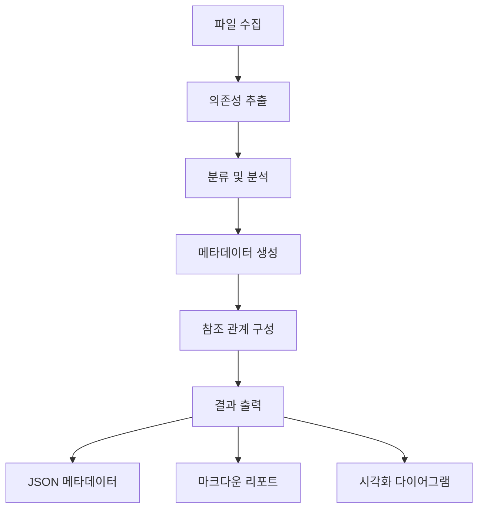

# Deps CLI

[](https://opensource.org/licenses/MIT)
[](https://www.typescriptlang.org/)
[](https://github.com/tj/commander.js/)

프로젝트 의존성을 분석하고 참조 관계를 시각화하는 간단하고 효율적인 CLI 도구입니다.

## ✨ 주요 기능

- 🔍 **의존성 분석**: TypeScript, JavaScript 파일 지원
- 🎯 **참조 관계 구성**: 내부 모듈 간 교차 참조 메타데이터 생성
- 📊 **간편한 출력**: JSON, 요약 형식 지원
- 📁 **유연한 저장**: 커스텀 디렉토리 출력 지원
- ⚡ **경량화**: 33KB 번들 크기로 빠른 실행

## 🚀 빠른 시작

### 설치 및 빌드

```bash
# 저장소 클론
git clone https://github.com/username/deps-cli.git
cd deps-cli

# 의존성 설치
npm install

# 프로젝트 빌드
npm run build
```

### 기본 사용법

```bash
# 파일 또는 디렉토리 분석
node dist/bin.js analyze src/

# 분류 및 저장
node dist/bin.js classify . --output-dir ./results

# 자세한 출력
node dist/bin.js analyze . --verbose
```

## 📊 분석 결과 예시

```
🔍 DEPS-CLI 프로젝트 의존성 분석 리포트
============================================================

📊 기본 통계:
  📁 총 파일: 68개
  🔗 총 의존성: 333개
  📈 평균 의존성: 4.9개/파일

🏆 의존성이 많은 파일 TOP 5:
  1. src/services/Queue/index.ts (13개 의존성)
  2. src/commands/ClassifyCommand.ts (11개 의존성)
  3. src/bin.ts (10개 의존성)
  4. src/layers/index.ts (8개 의존성)
  5. src/analyzers/MetadataExtractor.ts (7개 의존성)
```

## 🎯 사용법

### 분석 명령어

```bash
# 기본 분석 (요약 출력)
node dist/bin.js analyze src/

# JSON 형식 출력
node dist/bin.js analyze src/ --format json

# 자세한 출력
node dist/bin.js analyze src/ --verbose
```

### 분류 명령어

```bash
# 기본 분류
node dist/bin.js classify .

# 결과 저장
node dist/bin.js classify . --output-dir ./analysis-results

# 자세한 출력과 함께 저장
node dist/bin.js classify . --output-dir ./results --verbose
```

### 환경 변수 설정

deps-cli는 환경 변수를 통한 설정을 지원합니다:

```bash
# 기본 출력 형식 설정
export DEPS_CLI_DEFAULT_FORMAT=json

# 기본 출력 디렉토리 설정
export DEPS_CLI_DEFAULT_OUTPUT_DIR=./analysis-results

# 자세한 출력 활성화
export DEPS_CLI_VERBOSE=true

# 디버그 모드 활성화
export DEPS_CLI_DEBUG=true

# 분석 동시 실행 수 설정
export DEPS_CLI_MAX_CONCURRENCY=8

# Notion API 설정 (향후 사용)
export NOTION_API_KEY=secret_your_api_key_here
export NOTION_DATABASE_ID=your_database_id
```

설정 우선순위: CLI 옵션 > 환경 변수 > 기본값

## 📁 생성되는 파일들

### classify 명령어 출력 파일
- `analysis-report.json`: 분석 결과 요약
- `file-index.json`: 파일 인덱스
- `results/`: 상세 분석 결과
- `summary`: 요약 정보

## 🏗️ 아키텍처

### 핵심 컴포넌트

```
deps-cli/
├── src/
│   ├── analyzers/           # 의존성 분석 엔진
│   │   ├── CodeDependencyAnalyzer.ts
│   │   ├── TestDependencyAnalyzer.ts
│   │   ├── DocumentDependencyAnalyzer.ts
│   │   ├── UnifiedDependencyAnalyzer.ts
│   │   └── MetadataExtractor.ts
│   ├── commands/            # CLI 명령어
│   │   ├── ClassifyCommand.ts
│   │   └── AnalyzeCommand.ts
│   ├── types/              # 타입 정의
│   │   ├── DependencyClassification.ts
│   │   └── ReferenceMetadata.ts
│   └── utils/              # 유틸리티
│       ├── IdGenerator.ts
│       └── ProjectRootDetector.ts
└── docs/                   # 문서
```

### 데이터 플로우



## 🔧 API 문서

### FileMetadata 인터페이스

```typescript
interface FileMetadata {
  fileId: string                    // 고유 식별자
  filePath: string                  // 전체 경로
  relativePath: string              // 상대 경로
  fileType: 'code' | 'test' | 'docs' // 파일 타입
  dependencies: {
    internal: DependencyReference[] // 내부 모듈
    external: DependencyReference[] // 외부 라이브러리
    builtin: DependencyReference[]  // 내장 모듈
    test?: TestDependencies         // 테스트 관련
    docs?: DocumentDependencies     // 문서 관련
  }
  dependents: string[]              // 참조하는 파일들
  metadata: {
    complexity: number              // 복잡도 점수
    maintainability: number         // 유지보수성
    riskFactors: string[]          // 위험 요소
    clusters: string[]             // 클러스터 정보
  }
}
```

### 사용 예시

```typescript
import { MetadataExtractor } from './src/analyzers/MetadataExtractor.js'

const extractor = new MetadataExtractor('/project/root')
const metadata = await extractor.extractMetadata(analysisResult)

// 특정 파일의 의존성 확인
const file = metadata.files.find(f => f.relativePath === 'src/main.ts')
console.log(`${file.relativePath}의 내부 의존성:`, file.dependencies.internal)
```

## 🛠️ 개발 가이드

### 개발 환경 설정

```bash
# 레포지토리 클론
git clone https://github.com/username/deps-cli.git
cd deps-cli

# 의존성 설치
npm install

# 개발 빌드
npm run build

# 테스트 실행
npm test
```

### 테스트

현재 CLI 기능 테스트가 구현되어 있습니다:

```bash
# 모든 테스트 실행
npm test

# 테스트 커버리지 확인
npm run test -- --coverage
```

**테스트 현황:**
- ✅ CLI 명령어 테스트 (18개 테스트 통과)
- ✅ 기본 기능 테스트 (analyze, classify)
- ✅ 에러 처리 테스트
- ✅ 옵션 테스트
- ✅ 출력 형식 테스트

**향후 테스트 계획:**
- Phase 1: 설정 관리 테스트
- Phase 2: 데이터 저장소 테스트
- Phase 3: Notion 연동 테스트

### 새로운 분석기 추가

```typescript
// src/analyzers/MyCustomAnalyzer.ts
export class MyCustomAnalyzer {
  async analyze(filePath: string): Promise<CustomAnalysisResult> {
    // 분석 로직 구현
  }
}

// src/analyzers/UnifiedDependencyAnalyzer.ts에 등록
import { MyCustomAnalyzer } from './MyCustomAnalyzer.js'

export class UnifiedDependencyAnalyzer {
  private customAnalyzer = new MyCustomAnalyzer()

  async analyzeProject(files: string[]) {
    // 기존 분석에 커스텀 분석 추가
  }
}
```

## 📋 CLI 옵션

### analyze 명령어

| 옵션 | 타입 | 기본값 | 설명 |
|------|------|--------|------|
| `--format` | choice | `summary` | 출력 형식 (json, summary) |
| `--verbose` | boolean | `false` | 상세 출력 |

### classify 명령어

| 옵션 | 타입 | 기본값 | 설명 |
|------|------|--------|------|
| `--output-dir` | string | - | 결과 저장 디렉토리 |
| `--verbose` | boolean | `false` | 상세 출력 |

## 📖 문서

- 📚 **[고도화된 CLI 가이드](ENHANCED_CLI_GUIDE.md)** - 고급 옵션과 사용법
- 📊 **[분석 리포트 예시](demo-analysis-report.md)** - 실제 분석 결과 예시
- 🎯 **[시각화 도구](visualize-dependencies.cjs)** - 대화형 분석 도구
- 🔧 **[API 문서](docs/API.md)** - 상세 API 레퍼런스

## 🤝 기여하기

1. 이 레포지토리를 포크합니다
2. 기능 브랜치를 생성합니다 (`git checkout -b feature/amazing-feature`)
3. 변경사항을 커밋합니다 (`git commit -m 'Add amazing feature'`)
4. 브랜치에 푸시합니다 (`git push origin feature/amazing-feature`)
5. Pull Request를 생성합니다

### 코딩 스타일

- TypeScript strict mode 사용
- ESLint + Prettier 설정 따르기
- 모든 public API에 JSDoc 주석 필수

## 📄 라이선스

MIT License - 자세한 내용은 [LICENSE](LICENSE) 파일을 참조하세요.

## 🙏 감사의 말

- [Commander.js](https://github.com/tj/commander.js/) - CLI 프레임워크
- [@context-action/dependency-linker](https://github.com/context-action/dependency-linker) - 의존성 분석 엔진
- [glob](https://github.com/isaacs/node-glob) - 파일 매칭

---

**deps-cli**로 프로젝트의 의존성을 완벽하게 이해하고 관리하세요! 🚀