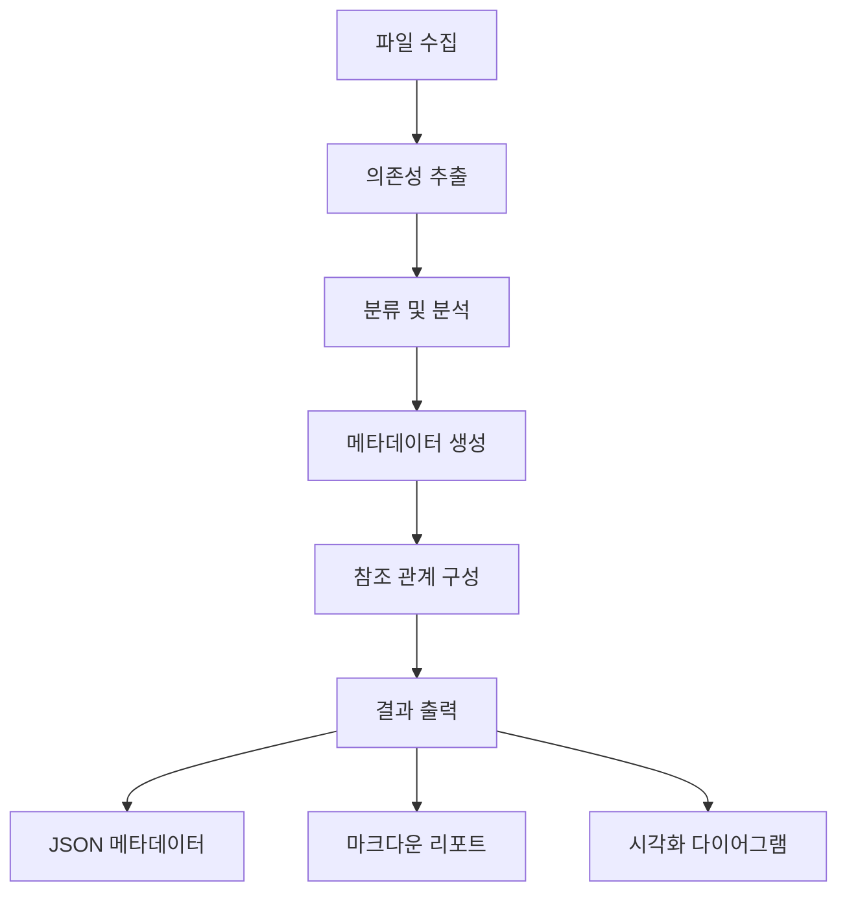

# Deps CLI

[](https://opensource.org/licenses/MIT)
[](https://www.typescriptlang.org/)
[](https://effect.website/)

프로젝트 의존성을 분석하고 참조 관계를 시각화하는 종합적인 CLI 도구입니다.

## ✨ 주요 기능

- 🔍 **다층 의존성 분석**: TypeScript, JavaScript, 마크다운, 테스트 파일 지원
- 🎯 **참조 관계 구성**: 내부 모듈 간 교차 참조 메타데이터 생성
- 📊 **시각화 지원**: Mermaid, DOT, 상세 리포트 자동 생성
- ⚙️ **고도화된 필터링**: 파일 패턴, 크기, 신뢰도 기반 정밀 분석
- 🚀 **성능 최적화**: 병렬 처리, 캐싱, 증분 분석 지원
- 📁 **유연한 출력**: 커스텀 디렉토리, 파일명, 다양한 형식 지원

## 🚀 빠른 시작

### 설치 및 빌드

```bash
# 저장소 클론
git clone https://github.com/username/deps-cli.git
cd deps-cli

# 의존성 설치
npm install

# 프로젝트 빌드
npm run build
```

### 기본 사용법

```bash
# 현재 프로젝트 분석
node dist/bin.cjs classify .

# 특정 디렉토리 분석
node dist/bin.cjs classify src/

# 시각화 도구 실행
node visualize-dependencies.cjs
```

## 📊 분석 결과 예시

```
🔍 DEPS-CLI 프로젝트 의존성 분석 리포트
============================================================

📊 기본 통계:
  📁 총 파일: 68개
  🔗 총 의존성: 333개
  📈 평균 의존성: 4.9개/파일

🏆 의존성이 많은 파일 TOP 5:
  1. src/services/Queue/index.ts (13개 의존성)
  2. src/commands/ClassifyCommand.ts (11개 의존성)
  3. src/bin.ts (10개 의존성)
  4. src/layers/index.ts (8개 의존성)
  5. src/analyzers/MetadataExtractor.ts (7개 의존성)
```

## 🎯 고급 사용법

### 커스텀 출력 설정

```bash
# 커스텀 디렉토리와 파일명
node dist/bin.cjs classify . \
  --output-dir ./analysis-results \
  --output-name "project-analysis"
```

### 정밀 필터링

```bash
# 특정 패턴만 분석
node dist/bin.cjs classify . \
  --include "src/**/*.ts,lib/**/*.ts" \
  --exclude "**/*.test.*,**/node_modules/**"

# 파일 크기와 신뢰도 기준 필터링
node dist/bin.cjs classify . \
  --min-file-size 1000 \
  --confidence-threshold 80
```

### 분석 깊이 조절

```bash
# 빠른 개요 분석
node dist/bin.cjs classify . --analysis-depth minimal

# 종합적 분석
node dist/bin.cjs classify . --analysis-depth comprehensive

# 심화 분석 (모든 세부사항)
node dist/bin.cjs classify . --analysis-depth deep
```

## 📁 생성되는 파일들

### 기본 출력
- `reference-metadata.json`: 완전한 참조 관계 메타데이터
- `analysis-report.json`: 분석 결과 요약
- `dependency-graph.json`: 의존성 그래프 데이터

### 리포트 활성화 시 (`--generate-report`)
- `{name}-report.md`: 상세 분석 리포트

### 시각화 활성화 시 (`--generate-viz`)
- `{name}-diagram.mmd`: Mermaid 다이어그램
- `{name}-graph.dot`: Graphviz DOT 파일

## 🏗️ 아키텍처

### 핵심 컴포넌트

```
deps-cli/
├── src/
│   ├── analyzers/           # 의존성 분석 엔진
│   │   ├── CodeDependencyAnalyzer.ts
│   │   ├── TestDependencyAnalyzer.ts
│   │   ├── DocumentDependencyAnalyzer.ts
│   │   ├── UnifiedDependencyAnalyzer.ts
│   │   └── MetadataExtractor.ts
│   ├── commands/            # CLI 명령어
│   │   ├── ClassifyCommand.ts
│   │   └── AnalyzeCommand.ts
│   ├── types/              # 타입 정의
│   │   ├── DependencyClassification.ts
│   │   └── ReferenceMetadata.ts
│   └── utils/              # 유틸리티
│       ├── IdGenerator.ts
│       └── ProjectRootDetector.ts
└── docs/                   # 문서
```

### 데이터 플로우



## 🔧 API 문서

### FileMetadata 인터페이스

```typescript
interface FileMetadata {
  fileId: string                    // 고유 식별자
  filePath: string                  // 전체 경로
  relativePath: string              // 상대 경로
  fileType: 'code' | 'test' | 'docs' // 파일 타입
  dependencies: {
    internal: DependencyReference[] // 내부 모듈
    external: DependencyReference[] // 외부 라이브러리
    builtin: DependencyReference[]  // 내장 모듈
    test?: TestDependencies         // 테스트 관련
    docs?: DocumentDependencies     // 문서 관련
  }
  dependents: string[]              // 참조하는 파일들
  metadata: {
    complexity: number              // 복잡도 점수
    maintainability: number         // 유지보수성
    riskFactors: string[]          // 위험 요소
    clusters: string[]             // 클러스터 정보
  }
}
```

### 사용 예시

```typescript
import { MetadataExtractor } from './src/analyzers/MetadataExtractor.js'

const extractor = new MetadataExtractor('/project/root')
const metadata = await extractor.extractMetadata(analysisResult)

// 특정 파일의 의존성 확인
const file = metadata.files.find(f => f.relativePath === 'src/main.ts')
console.log(`${file.relativePath}의 내부 의존성:`, file.dependencies.internal)
```

## 🛠️ 개발 가이드

### 개발 환경 설정

```bash
# 레포지토리 클론
git clone https://github.com/username/deps-cli.git
cd deps-cli

# 의존성 설치
npm install

# 개발 빌드
npm run build

# 테스트 실행
npm test
```

### 새로운 분석기 추가

```typescript
// src/analyzers/MyCustomAnalyzer.ts
export class MyCustomAnalyzer {
  async analyze(filePath: string): Promise<CustomAnalysisResult> {
    // 분석 로직 구현
  }
}

// src/analyzers/UnifiedDependencyAnalyzer.ts에 등록
import { MyCustomAnalyzer } from './MyCustomAnalyzer.js'

export class UnifiedDependencyAnalyzer {
  private customAnalyzer = new MyCustomAnalyzer()

  async analyzeProject(files: string[]) {
    // 기존 분석에 커스텀 분석 추가
  }
}
```

## 📋 CLI 옵션 전체 목록

| 옵션 | 타입 | 기본값 | 설명 |
|------|------|--------|------|
| `--output-dir` | string | `.deps-analysis` | 결과 저장 디렉토리 |
| `--output-name` | string | `analysis-result` | 출력 파일명 프리픽스 |
| `--format` | choice | `json` | 출력 형식 (json, sqlite, neo4j, graphml) |
| `--analysis-depth` | choice | `standard` | 분석 깊이 (minimal, standard, comprehensive, deep) |
| `--include` | string | - | 포함할 파일 패턴 (쉼표 구분) |
| `--exclude` | string | - | 제외할 파일 패턴 (쉼표 구분) |
| `--min-file-size` | number | `0` | 최소 파일 크기 (bytes) |
| `--max-file-size` | number | `10485760` | 최대 파일 크기 (bytes) |
| `--confidence-threshold` | number | `50` | 신뢰도 임계값 (0-100%) |
| `--generate-report` | boolean | `true` | 리포트 생성 여부 |
| `--generate-viz` | boolean | `false` | 시각화 생성 여부 |
| `--parallel` | boolean | `true` | 병렬 처리 활성화 |
| `--enable-cache` | boolean | `true` | 캐싱 활성화 |
| `--compression` | boolean | `false` | 결과 압축 |
| `--incremental` | boolean | `false` | 증분 분석 모드 |
| `--verbose` | boolean | `false` | 상세 출력 |

## 📖 문서

- 📚 **[고도화된 CLI 가이드](ENHANCED_CLI_GUIDE.md)** - 고급 옵션과 사용법
- 📊 **[분석 리포트 예시](demo-analysis-report.md)** - 실제 분석 결과 예시
- 🎯 **[시각화 도구](visualize-dependencies.cjs)** - 대화형 분석 도구
- 🔧 **[API 문서](docs/API.md)** - 상세 API 레퍼런스

## 🤝 기여하기

1. 이 레포지토리를 포크합니다
2. 기능 브랜치를 생성합니다 (`git checkout -b feature/amazing-feature`)
3. 변경사항을 커밋합니다 (`git commit -m 'Add amazing feature'`)
4. 브랜치에 푸시합니다 (`git push origin feature/amazing-feature`)
5. Pull Request를 생성합니다

### 코딩 스타일

- TypeScript strict mode 사용
- Effect.js 함수형 프로그래밍 패턴 준수
- ESLint + Prettier 설정 따르기
- 모든 public API에 JSDoc 주석 필수

## 📄 라이선스

MIT License - 자세한 내용은 [LICENSE](LICENSE) 파일을 참조하세요.

## 🙏 감사의 말

- [Effect](https://effect.website/) - 함수형 프로그래밍 프레임워크
- [@context-action/dependency-linker](https://github.com/context-action/dependency-linker) - 의존성 분석 엔진
- [Mermaid](https://mermaid.js.org/) - 다이어그램 생성
- [Graphviz](https://graphviz.org/) - 그래프 시각화

---

**deps-cli**로 프로젝트의 의존성을 완벽하게 이해하고 관리하세요! 🚀