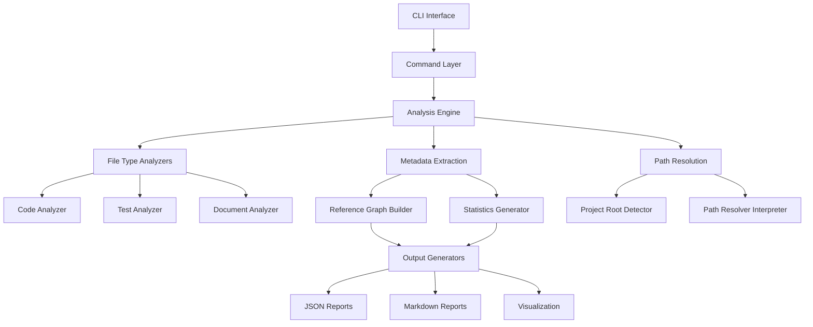
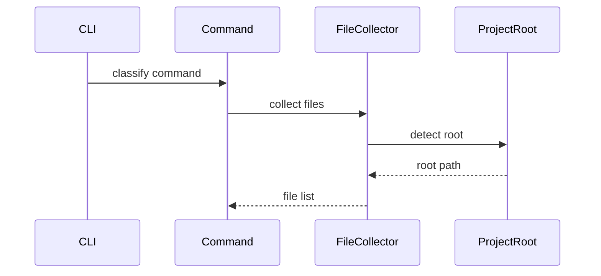
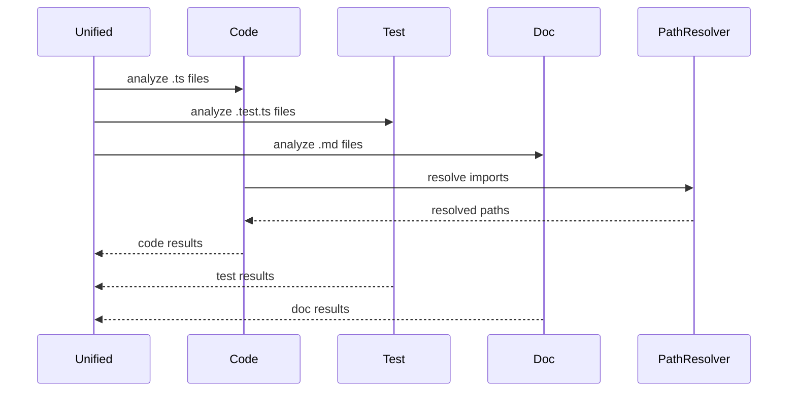
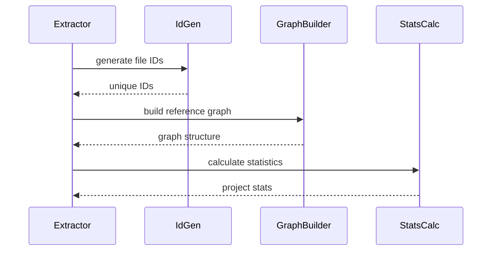
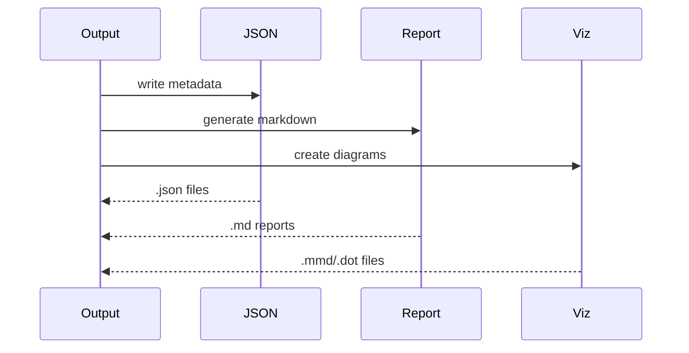

# 아키텍처 문서

## 개요

deps-cli는 함수형 프로그래밍 패러다임을 기반으로 한 모듈화된 의존성 분석 도구입니다. Effect.js 프레임워크를 사용하여 타입 안전성과 함수형 프로그래밍의 장점을 활용합니다.

## 시스템 아키텍처

### 고수준 아키텍처



### 레이어 구조

```
┌─────────────────────────────────┐
│         CLI Interface           │
│     (bin.ts, Commands)          │
├─────────────────────────────────┤
│       Business Logic            │
│   (Analyzers, Extractors)       │
├─────────────────────────────────┤
│       Core Services             │
│  (Path Resolution, ID Gen)      │
├─────────────────────────────────┤
│         Utilities               │
│   (File I/O, Type Defs)         │
└─────────────────────────────────┘
```

## 핵심 컴포넌트

### 1. CLI Interface Layer

#### bin.ts
- 애플리케이션 진입점
- Effect CLI 프레임워크 통합
- 명령어 라우팅

```typescript
// 핵심 구조
const program = Command.make("deps-cli", {
  classify: ClassifyCommand.command
})

Effect.runMain(CliApp.run(program, {
  name: "Deps CLI",
  version: "1.0.0"
}))
```

#### Commands Layer
- **ClassifyCommand**: 의존성 분류 및 분석
- **AnalyzeCommand**: 상세 의존성 분석 (deprecated)

### 2. Analysis Engine

#### UnifiedDependencyAnalyzer
중앙 분석 엔진으로 모든 파일 타입 분석을 조정합니다.

```typescript
class UnifiedDependencyAnalyzer {
  // 주요 메서드
  analyzeProject(files: string[]): Promise<UnifiedAnalysisResult>
  analyzeByType(files: string[]): Promise<TypeGroupedResult>
  analyzeFile(filePath: string): Promise<FileAnalysisResult>
}
```

**역할:**
- 파일 타입 분류 및 라우팅
- 병렬 분석 처리
- 결과 통합 및 정규화

#### 개별 분석기들

**CodeDependencyAnalyzer**
- TypeScript/JavaScript 파일 분석
- AST 파싱을 통한 import/require 추출
- 타입 정의 및 모듈 해결

**TestDependencyAnalyzer**
- 테스트 파일 전용 분석
- 테스트 대상 코드 식별
- 테스트 유틸리티 분류

**DocumentDependencyAnalyzer**
- 마크다운 문서 분석
- 링크 및 참조 검증
- 문서 간 연결 관계 구성

### 3. Path Resolution System

#### ProjectRootDetector
프로젝트 루트 디렉토리를 자동 탐지합니다.

```typescript
class ProjectRootDetector {
  detectProjectRoot(startPath: string): string

  // 탐지 전략
  private strategies = [
    this.findPackageJson,
    this.findGitRoot,
    this.findConfigFiles,
    this.fallbackToStartPath
  ]
}
```

#### PathResolverInterpreter
@context-action/dependency-linker 통합으로 정확한 경로 해결을 제공합니다.

```typescript
class EnhancedAnalyzer {
  private pathResolver: PathResolverInterpreter

  // 경로 해결 과정
  async resolveImportPath(importPath: string, fromFile: string): Promise<string>
}
```

### 4. Metadata Extraction System

#### MetadataExtractor
분석 결과를 구조화된 메타데이터로 변환합니다.

```typescript
class MetadataExtractor {
  // 주요 변환 과정
  extractMetadata(result: UnifiedAnalysisResult): ProjectReferenceData {
    this.generateFileIds(result)
    const files = this.extractFileMetadata(result)
    const graph = this.buildReferenceGraph(files)
    const stats = this.calculateStatistics(files)
    return { project, files, graph, stats }
  }
}
```

**처리 단계:**
1. 파일 ID 생성
2. 의존성 분류 및 정규화
3. 참조 그래프 구성
4. 통계 정보 계산

#### IdGenerator
고유 식별자 생성 전략을 제공합니다.

```typescript
class IdGenerator {
  strategies = {
    hash: (path: string) => crypto.createHash('sha1').update(path).digest('hex'),
    pathBased: (path: string) => path.replace(/[\/\\]/g, '-'),
    sequential: (path: string) => `file-${this.counter++}`
  }
}
```

## 데이터 플로우

### 1. 입력 단계



### 2. 분석 단계



### 3. 메타데이터 추출



### 4. 출력 단계



## 타입 시스템

### 핵심 데이터 구조

```typescript
// 분석 결과의 계층 구조
interface UnifiedAnalysisResult {
  code: FileAnalysisResult[]     // TypeScript/JS 파일들
  test: FileAnalysisResult[]     // 테스트 파일들
  docs: FileAnalysisResult[]     // 문서 파일들
  library: FileAnalysisResult[]  // 라이브러리 참조들
}

// 개별 파일 분석 결과
interface FileAnalysisResult {
  filePath: string
  fileType: FileType
  dependencies: FileDependencies
  metadata: AnalysisMetadata
}

// 최종 메타데이터 구조
interface ProjectReferenceData {
  project: ProjectMetadata
  files: FileMetadata[]
  referenceGraph: ReferenceGraph
  statistics: ProjectStatistics
}
```

### 의존성 분류 체계

```typescript
type DependencyType =
  // 코드 의존성
  | 'internal-module'      // 프로젝트 내부 모듈
  | 'external-library'     // 외부 라이브러리
  | 'builtin-module'       // Node.js 내장 모듈

  // 테스트 의존성
  | 'test-target'          // 테스트 대상 코드
  | 'test-utility'         // 테스트 도구/유틸리티
  | 'test-setup'           // 테스트 설정/픽스처

  // 문서 의존성
  | 'doc-reference'        // 내부 문서 참조
  | 'doc-link'            // 외부 링크
  | 'doc-asset'           // 이미지/파일 에셋
```

## 확장성 설계

### 플러그인 아키텍처

새로운 파일 타입이나 분석 기능을 쉽게 추가할 수 있도록 설계되었습니다.

```typescript
// 새로운 분석기 인터페이스
interface FileAnalyzer {
  analyze(filePath: string): Promise<FileAnalysisResult>
  supportsFileType(filePath: string): boolean
}

// UnifiedDependencyAnalyzer에 등록
class UnifiedDependencyAnalyzer {
  registerAnalyzer(name: string, analyzer: FileAnalyzer): void
}
```

### 설정 시스템

```typescript
interface AnalysisConfig {
  // 분석 옵션
  analysisDepth: 'minimal' | 'standard' | 'comprehensive' | 'deep'
  confidenceThreshold: number

  // 필터링 옵션
  includePatterns: string[]
  excludePatterns: string[]
  minFileSize: number
  maxFileSize: number

  // 성능 옵션
  enableParallel: boolean
  enableCache: boolean
  enableIncremental: boolean
}
```

## 성능 최적화

### 1. 병렬 처리

```typescript
// 파일 그룹별 병렬 분석
const analysisPromises = fileGroups.map(group =>
  this.analyzeFileGroup(group)
)
const results = await Promise.all(analysisPromises)
```

### 2. 캐싱 전략

```typescript
class AnalysisCache {
  // 파일 해시 기반 캐싱
  async getCachedResult(filePath: string): Promise<FileAnalysisResult | null>
  async setCachedResult(filePath: string, result: FileAnalysisResult): Promise<void>
}
```

### 3. 증분 분석

```typescript
class IncrementalAnalyzer {
  // 변경된 파일만 재분석
  async analyzeChanges(previousResult: UnifiedAnalysisResult): Promise<UnifiedAnalysisResult>
}
```

## 에러 처리 전략

### 1. 계층적 에러 처리

```typescript
// Effect.js의 에러 타입 시스템 활용
type AnalysisError =
  | FileNotFoundError
  | ParseError
  | DependencyResolutionError
  | ConfigurationError

// 에러 복구 전략
const analysisResult = await analyzer.analyzeFile(filePath)
  .pipe(
    Effect.catchTag("ParseError", () => Effect.succeed(emptyResult)),
    Effect.catchTag("FileNotFoundError", () => Effect.fail(criticalError))
  )
```

### 2. 부분 실패 허용

분석 중 일부 파일에서 오류가 발생해도 전체 분석이 중단되지 않도록 설계되었습니다.

```typescript
// 개별 파일 분석 실패 시 로깅 후 계속 진행
const results = await Promise.allSettled(
  files.map(file => this.analyzeFile(file))
)
```

## 테스트 전략

### 1. 단위 테스트

각 분석기는 독립적으로 테스트 가능하도록 설계되었습니다.

```typescript
describe('CodeDependencyAnalyzer', () => {
  it('should extract TypeScript imports', async () => {
    const result = await analyzer.analyze('sample.ts')
    expect(result.dependencies.internal).toHaveLength(2)
  })
})
```

### 2. 통합 테스트

실제 프로젝트 구조를 사용한 end-to-end 테스트를 제공합니다.

```typescript
describe('Integration Tests', () => {
  it('should analyze sample project correctly', async () => {
    const result = await unifiedAnalyzer.analyzeProject(sampleFiles)
    expect(result.code).toHaveLength(5)
    expect(result.test).toHaveLength(3)
  })
})
```

## 보안 고려사항

### 1. 파일 시스템 접근 제한

```typescript
// 안전한 경로 검증
function isPathSafe(path: string, projectRoot: string): boolean {
  const resolvedPath = path.resolve(path)
  return resolvedPath.startsWith(projectRoot)
}
```

### 2. 입력 검증

```typescript
// CLI 입력 검증
const pathSchema = z.string().regex(/^[a-zA-Z0-9\/\-_.]+$/)
const validatedPath = pathSchema.parse(userInput)
```

## 모니터링 및 로깅

### 1. 구조화된 로깅

```typescript
const logger = Effect.logInfo("Analysis started", {
  projectRoot,
  fileCount: files.length,
  options: analysisOptions
})
```

### 2. 성능 메트릭

```typescript
interface AnalysisMetrics {
  totalFiles: number
  analysisTimeMs: number
  memoryUsageMB: number
  errorCount: number
}
```

## 배포 및 운영

### 1. 빌드 시스템

```json
{
  "scripts": {
    "build": "tsc && chmod +x dist/bin.cjs",
    "build:watch": "tsc --watch",
    "build:prod": "tsc --build --clean && tsc"
  }
}
```

### 2. 패키징

```javascript
// bin 필드로 CLI 도구 등록
{
  "bin": {
    "deps-cli": "dist/bin.cjs"
  }
}
```

## 향후 발전 방향

### 1. 추가 분석기
- Vue.js Single File Components
- Svelte 컴포넌트
- CSS/SCSS 의존성
- SQL 쿼리 분석

### 2. 고급 분석 기능
- 순환 의존성 탐지 및 해결 제안
- 사용되지 않는 코드 식별
- 성능 영향도 분석
- 리팩토링 추천

### 3. 통합 도구
- IDE 플러그인
- GitHub Actions
- 웹 대시보드
- API 서버 모드