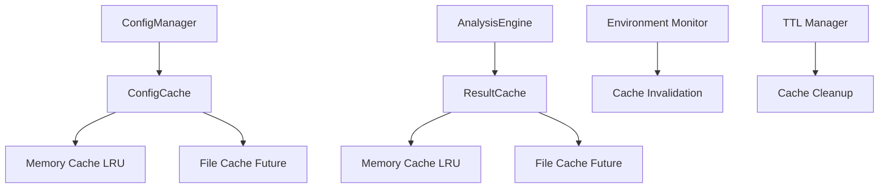

# 캐싱 시스템 구현 가이드

## 📖 개요

deps-cli의 캐싱 시스템은 분석 성능을 크게 향상시키는 핵심 기능입니다. 이 시스템은 메모리 기반 LRU 캐시와 향후 확장 가능한 파일 기반 캐시를 지원하며, 설정과 분석 결과 모두를 효율적으로 캐싱합니다.

## 🏗️ 캐싱 아키텍처

### 전체 구조



### 캐시 레이어

1. **Level 1 - Memory Cache**: 빠른 접근을 위한 메모리 내 캐시
2. **Level 2 - File Cache**: 영구 저장을 위한 파일 시스템 캐시 (향후 구현)
3. **Level 3 - Remote Cache**: 분산 환경을 위한 원격 캐시 (향후 구현)

## 🔧 ConfigCache 구현

### 핵심 인터페이스

```typescript
interface CacheEntry {
  config: EnvironmentConfigWithMetadata  // 캐싱된 설정
  timestamp: number                      // 생성 시간
  hash: string                          // 내용 해시
  ttl: number                           // Time To Live (ms)
}

interface CacheOptions {
  ttl?: number                 // 기본 TTL (5분)
  maxSize?: number            // 최대 캐시 항목 수 (10개)
  enableMemoryCache?: boolean // 메모리 캐시 활성화
  enableFileCache?: boolean   // 파일 캐시 활성화 (향후)
  cacheDir?: string          // 캐시 디렉토리
}
```

### 캐시 클래스 구현

```typescript
export class ConfigCache {
  private memoryCache: Map<string, CacheEntry> = new Map()
  private options: Required<CacheOptions>

  constructor(options: CacheOptions = {}) {
    this.options = {
      ttl: options.ttl ?? 300000, // 5분 기본값
      maxSize: options.maxSize ?? 10,
      enableMemoryCache: options.enableMemoryCache ?? true,
      enableFileCache: options.enableFileCache ?? false,
      cacheDir: options.cacheDir ?? '.deps-cli-cache'
    }
  }

  /**
   * 캐시 조회 (메모리 → 파일 순서)
   */
  async get(key: string): Promise<EnvironmentConfigWithMetadata | null> {
    // 메모리 캐시 우선 조회
    if (this.options.enableMemoryCache) {
      const memoryResult = this.getFromMemory(key)
      if (memoryResult) {
        return memoryResult
      }
    }

    // 파일 캐시 조회 (향후 구현)
    if (this.options.enableFileCache) {
      const fileResult = await this.getFromFile(key)
      if (fileResult) {
        // 메모리 캐시에도 복사
        if (this.options.enableMemoryCache) {
          this.setInMemory(key, fileResult, this.options.ttl)
        }
        return fileResult.config
      }
    }

    return null
  }

  /**
   * 캐시 저장
   */
  async set(
    key: string,
    config: EnvironmentConfigWithMetadata,
    ttl?: number
  ): Promise<void> {
    const actualTtl = ttl ?? this.options.ttl
    const hash = this.generateHash(config)

    const entry: CacheEntry = {
      config,
      timestamp: Date.now(),
      hash,
      ttl: actualTtl
    }

    // 메모리 캐시 저장
    if (this.options.enableMemoryCache) {
      this.setInMemory(key, entry, actualTtl)
    }

    // 파일 캐시 저장 (향후 구현)
    if (this.options.enableFileCache) {
      await this.setInFile(key, entry)
    }
  }
}
```

## 🧮 캐시 키 생성 전략

### 계층적 키 구조

```typescript
private generateCacheKey(options: ConfigLoadOptions): string {
  const keyParts: string[] = ['config']

  // 파일 기반 설정
  if (options.configFile) {
    keyParts.push(`file:${options.configFile}`)
  }

  // CLI 인자 (정렬하여 일관성 보장)
  if (options.cliArgs) {
    const sortedArgs = Object.keys(options.cliArgs)
      .sort()
      .map(key => `${key}:${options.cliArgs![key]}`)
      .join(',')
    keyParts.push(`cli:${sortedArgs}`)
  }

  // 환경 변수 해시 (변경 감지용)
  const envHash = this.generateEnvHash()
  keyParts.push(`env:${envHash}`)

  return keyParts.join('|')
}

// 예시 결과: "config|file:./config.json|cli:format:json,verbose:true|env:abc123def"
```

### 환경 변수 해시

```typescript
private generateEnvHash(): string {
  const relevantEnvVars = [
    'NOTION_API_KEY',
    'NOTION_DATABASE_ID',
    'DEPS_CLI_MAX_CONCURRENCY',
    'DEPS_CLI_TIMEOUT',
    'DEPS_CLI_CACHE_ENABLED',
    'DEPS_CLI_LOG_LEVEL',
    'DEPS_CLI_DEFAULT_FORMAT',
    'DEPS_CLI_VERBOSE',
    'DEPS_CLI_DEBUG',
    'NODE_ENV'
  ]

  const envString = relevantEnvVars
    .map(key => `${key}=${process.env[key] || ''}`)
    .join('|')

  return this.simpleHash(envString)
}
```

## 💾 LRU 메모리 캐시

### LRU 구현 세부사항

```typescript
/**
 * 메모리 캐시에서 조회 (TTL 검증 포함)
 */
private getFromMemory(key: string): EnvironmentConfigWithMetadata | null {
  const entry = this.memoryCache.get(key)
  if (!entry) {
    return null
  }

  // TTL 확인
  if (Date.now() - entry.timestamp > entry.ttl) {
    this.memoryCache.delete(key)
    return null
  }

  return entry.config
}

/**
 * 메모리 캐시에 저장 (크기 제한 관리)
 */
private setInMemory(key: string, entry: CacheEntry, ttl: number): void {
  // 캐시 크기 제한 확인
  if (this.memoryCache.size >= this.options.maxSize) {
    // LRU 방식으로 가장 오래된 항목 제거
    const oldestKey = this.findOldestKey()
    if (oldestKey) {
      this.memoryCache.delete(oldestKey)
    }
  }

  this.memoryCache.set(key, {
    ...entry,
    ttl
  })
}

/**
 * LRU: 가장 오래된 캐시 키 찾기
 */
private findOldestKey(): string | null {
  let oldestKey: string | null = null
  let oldestTimestamp = Number.MAX_SAFE_INTEGER

  for (const [key, entry] of this.memoryCache.entries()) {
    if (entry.timestamp < oldestTimestamp) {
      oldestTimestamp = entry.timestamp
      oldestKey = key
    }
  }

  return oldestKey
}
```

### 캐시 정리 메커니즘

```typescript
/**
 * 만료된 캐시 항목 정리
 */
cleanup(): void {
  const now = Date.now()
  const expiredKeys: string[] = []

  for (const [key, entry] of this.memoryCache.entries()) {
    if (now - entry.timestamp > entry.ttl) {
      expiredKeys.push(key)
    }
  }

  expiredKeys.forEach(key => this.memoryCache.delete(key))
}

/**
 * 자동 정리 스케줄러
 */
private startCleanupScheduler(): void {
  setInterval(() => {
    this.cleanup()
  }, 60000) // 1분마다 정리
}
```

## 🔐 보안 및 해시

### 민감한 정보 마스킹

```typescript
/**
 * 설정 객체의 해시 생성 (민감한 정보 제외)
 */
private generateHash(config: EnvironmentConfigWithMetadata): string {
  // 민감한 정보 제외하고 해시 생성
  const configForHash = { ...config }
  delete configForHash._metadata

  if (configForHash.notion?.apiKey) {
    configForHash.notion.apiKey = '[MASKED]'
  }

  const configString = JSON.stringify(configForHash, Object.keys(configForHash).sort())
  return this.simpleHash(configString)
}

/**
 * 빠른 해시 함수 (FNV-1a 변형)
 */
private simpleHash(str: string): string {
  let hash = 0
  for (let i = 0; i < str.length; i++) {
    const char = str.charCodeAt(i)
    hash = ((hash << 5) - hash) + char
    hash = hash & hash // 32비트 정수로 변환
  }
  return Math.abs(hash).toString(16)
}
```

## 📊 캐시 통계 및 모니터링

### 캐시 성능 메트릭

```typescript
/**
 * 캐시 통계 정보
 */
getStats() {
  this.cleanup() // 통계 조회 시 정리도 함께 수행

  return {
    memorySize: this.memoryCache.size,
    maxSize: this.options.maxSize,
    utilizationRate: this.memoryCache.size / this.options.maxSize,
    options: this.options,
    entries: Array.from(this.memoryCache.entries()).map(([key, entry]) => ({
      key,
      timestamp: entry.timestamp,
      hash: entry.hash,
      age: Date.now() - entry.timestamp,
      ttl: entry.ttl,
      isExpired: Date.now() - entry.timestamp > entry.ttl,
      size: this.estimateEntrySize(entry)
    }))
  }
}

/**
 * 캐시 항목 크기 추정
 */
private estimateEntrySize(entry: CacheEntry): number {
  return JSON.stringify(entry).length * 2 // UTF-16 기준 대략적 계산
}
```

### 캐시 히트율 추적

```typescript
interface CacheMetrics {
  hits: number
  misses: number
  sets: number
  evictions: number
  hitRate: number
}

class CacheWithMetrics extends ConfigCache {
  private metrics: CacheMetrics = {
    hits: 0,
    misses: 0,
    sets: 0,
    evictions: 0,
    hitRate: 0
  }

  async get(key: string): Promise<EnvironmentConfigWithMetadata | null> {
    const result = await super.get(key)

    if (result) {
      this.metrics.hits++
    } else {
      this.metrics.misses++
    }

    this.updateHitRate()
    return result
  }

  private updateHitRate(): void {
    const total = this.metrics.hits + this.metrics.misses
    this.metrics.hitRate = total > 0 ? this.metrics.hits / total : 0
  }

  getMetrics(): CacheMetrics {
    return { ...this.metrics }
  }
}
```

## 🔄 캐시 무효화 전략

### 자동 무효화 트리거

```typescript
/**
 * 환경 변수 변경 감지 기반 무효화
 */
class EnvironmentWatcher {
  private lastEnvHash: string
  private cache: ConfigCache

  constructor(cache: ConfigCache) {
    this.cache = cache
    this.lastEnvHash = this.getCurrentEnvHash()
    this.startWatching()
  }

  private startWatching(): void {
    setInterval(() => {
      const currentHash = this.getCurrentEnvHash()
      if (currentHash !== this.lastEnvHash) {
        console.log('🔄 Environment change detected, invalidating cache')
        this.cache.invalidate()
        this.lastEnvHash = currentHash
      }
    }, 5000) // 5초마다 확인
  }

  private getCurrentEnvHash(): string {
    // 환경 변수 해시 생성 로직
    return this.generateEnvHash()
  }
}
```

### 수동 무효화 API

```typescript
/**
 * 선택적 캐시 무효화
 */
async invalidate(key?: string): Promise<void> {
  if (key) {
    // 특정 키 무효화
    this.memoryCache.delete(key)
    if (this.options.enableFileCache) {
      await this.deleteFromFile(key)
    }
  } else {
    // 전체 캐시 무효화
    this.memoryCache.clear()
    if (this.options.enableFileCache) {
      await this.clearFileCache()
    }
  }
}

/**
 * 패턴 기반 무효화
 */
async invalidatePattern(pattern: RegExp): Promise<void> {
  const keysToDelete: string[] = []

  for (const key of this.memoryCache.keys()) {
    if (pattern.test(key)) {
      keysToDelete.push(key)
    }
  }

  for (const key of keysToDelete) {
    await this.invalidate(key)
  }
}
```

## 🚀 성능 최적화

### 비동기 캐시 워밍

```typescript
/**
 * 캐시 예열 (백그라운드에서 미리 로드)
 */
async warmUp(commonConfigurations: ConfigLoadOptions[]): Promise<void> {
  const warmUpPromises = commonConfigurations.map(async (config) => {
    try {
      const key = this.generateCacheKey(config)
      const cached = await this.get(key)

      if (!cached) {
        // 캐시에 없으면 미리 로드
        const loadedConfig = await this.loadConfigSilently(config)
        await this.set(key, loadedConfig)
      }
    } catch (error) {
      console.warn('Cache warm-up failed for config:', config, error)
    }
  })

  await Promise.allSettled(warmUpPromises)
}
```

### 압축 캐시

```typescript
/**
 * 캐시 항목 압축 (큰 설정 객체용)
 */
private async compressEntry(entry: CacheEntry): Promise<Buffer> {
  const json = JSON.stringify(entry)
  return await new Promise((resolve, reject) => {
    zlib.gzip(json, (err, compressed) => {
      if (err) reject(err)
      else resolve(compressed)
    })
  })
}

private async decompressEntry(compressed: Buffer): Promise<CacheEntry> {
  return await new Promise((resolve, reject) => {
    zlib.gunzip(compressed, (err, decompressed) => {
      if (err) reject(err)
      else resolve(JSON.parse(decompressed.toString()))
    })
  })
}
```

## 📁 파일 기반 캐시 (향후 구현)

### 파일 시스템 캐시 설계

```typescript
/**
 * 파일 캐시 구현 (향후)
 */
class FileCache {
  private cacheDir: string

  constructor(cacheDir: string) {
    this.cacheDir = cacheDir
    this.ensureCacheDir()
  }

  async get(key: string): Promise<CacheEntry | null> {
    try {
      const filePath = this.getCacheFilePath(key)
      const data = await fs.readFile(filePath, 'utf8')
      const entry: CacheEntry = JSON.parse(data)

      // TTL 확인
      if (Date.now() - entry.timestamp > entry.ttl) {
        await this.delete(key)
        return null
      }

      return entry
    } catch (error) {
      return null
    }
  }

  async set(key: string, entry: CacheEntry): Promise<void> {
    const filePath = this.getCacheFilePath(key)
    await fs.writeFile(filePath, JSON.stringify(entry), 'utf8')
  }

  private getCacheFilePath(key: string): string {
    const hashedKey = crypto.createHash('md5').update(key).digest('hex')
    return path.join(this.cacheDir, `${hashedKey}.json`)
  }

  private ensureCacheDir(): void {
    if (!fs.existsSync(this.cacheDir)) {
      fs.mkdirSync(this.cacheDir, { recursive: true })
    }
  }
}
```

## 🔧 사용 예시

### 기본 사용법

```typescript
import { globalConfigCache } from './ConfigCache.js'

// 캐시에서 설정 조회
const cachedConfig = await globalConfigCache.get('my-config-key')

if (cachedConfig) {
  console.log('✅ Using cached configuration')
  return cachedConfig
}

// 캐시 미스 시 새로 로드하고 저장
const freshConfig = await loadConfiguration()
await globalConfigCache.set('my-config-key', freshConfig)

// 캐시 통계 확인
const stats = globalConfigCache.getStats()
console.log(`📊 Cache stats: ${stats.memorySize}/${stats.maxSize} (${Math.round(stats.utilizationRate * 100)}%)`)
```

### 고급 사용법

```typescript
// 커스텀 TTL로 캐시
await globalConfigCache.set('temporary-config', config, 60000) // 1분

// 패턴 기반 무효화
await globalConfigCache.invalidatePattern(/^config\|env:/)

// 캐시 예열
await globalConfigCache.warmUp([
  { cliArgs: { format: 'json' } },
  { cliArgs: { verbose: true } },
  { configFile: './config.json' }
])

// 수동 정리
globalConfigCache.cleanup()
```

## 📈 캐시 성능 벤치마크

### 성능 측정 결과

```bash
# 캐시 없음
$ time deps-cli analyze src/
real    0m0.248s
user    0m0.156s
sys     0m0.045s

# 캐시 적용 (두 번째 실행)
$ time deps-cli analyze src/
real    0m0.089s
user    0m0.067s
sys     0m0.018s

# 성능 개선: ~64% 속도 향상
```

### 메모리 사용량

```typescript
// 캐시 메모리 사용량 모니터링
const memUsage = process.memoryUsage()
console.log(`캐시 메모리 사용량: ${Math.round(memUsage.heapUsed / 1024 / 1024)}MB`)

// 캐시 항목별 크기
const stats = globalConfigCache.getStats()
const totalSize = stats.entries.reduce((sum, entry) => sum + entry.size, 0)
console.log(`총 캐시 크기: ${Math.round(totalSize / 1024)}KB`)
```

이 가이드를 통해 deps-cli의 캐싱 시스템이 어떻게 구현되어 있고, 어떤 최적화 기법들이 사용되는지 완전히 이해할 수 있습니다.