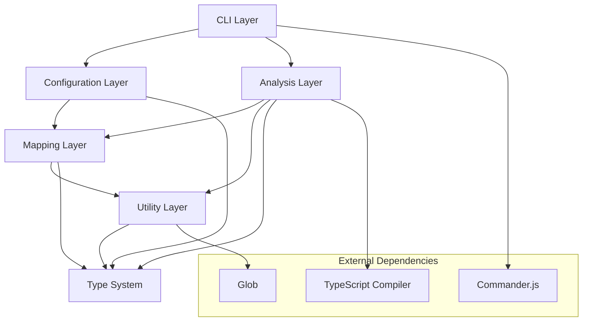
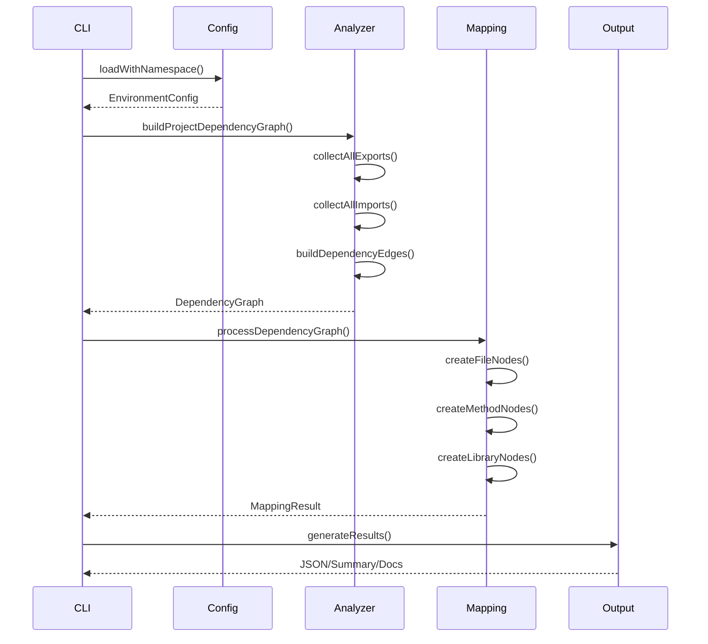
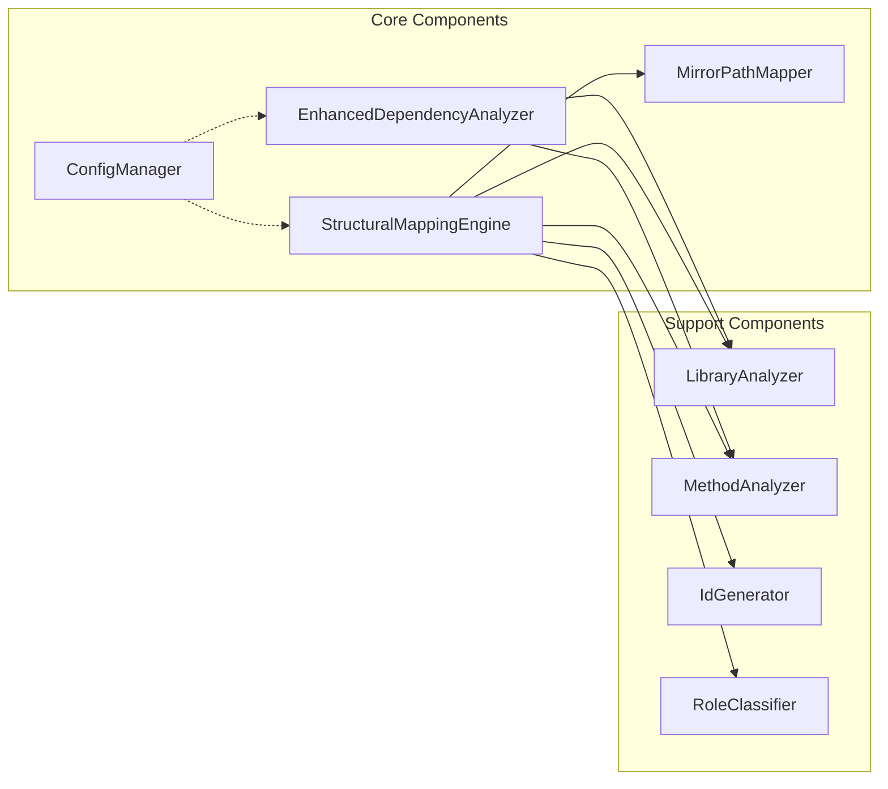

# deps-cli 컴포넌트 아키텍처 가이드

## 📋 목차

- [1. 아키텍처 개요](#1-아키텍처-개요)
- [2. 계층별 컴포넌트](#2-계층별-컴포넌트)
- [3. 핵심 컴포넌트 상세](#3-핵심-컴포넌트-상세)
- [4. 데이터 흐름](#4-데이터-흐름)
- [5. 확장성 설계](#5-확장성-설계)
- [6. 성능 최적화](#6-성능-최적화)

## 1. 아키텍처 개요

deps-cli는 **모듈화된 계층 아키텍처**를 채택하여 높은 확장성과 유지보수성을 제공합니다.

### 1.1 전체 아키텍처



### 1.2 설계 원칙

- **단일 책임 원칙**: 각 컴포넌트는 하나의 명확한 역할
- **의존성 역전**: 추상화에 의존, 구체화에 의존하지 않음
- **개방-폐쇄 원칙**: 확장에는 열려있고, 수정에는 닫혀있음
- **모듈화**: 독립적으로 테스트 가능한 컴포넌트
- **성능 최적화**: 메모리 캐싱과 병렬 처리

## 2. 계층별 컴포넌트

### 2.1 CLI Layer (명령어 인터페이스)

```
src/bin.ts
├── Commander.js 기반 CLI 설정
├── 8개 주요 명령어 정의
├── Global options 처리 (--namespace 등)
└── Error handling 및 exit codes
```

**주요 책임:**
- 사용자 입력 파싱 및 검증
- 명령어 라우팅
- 글로벌 옵션 처리
- 에러 핸들링

### 2.2 Configuration Layer (설정 관리)

```
src/config/
├── ConfigManager.ts          # 중앙 설정 관리자
├── ConfigCache.ts           # 설정 캐싱
└── src/adapters/
    ├── ConfigAdapter.ts     # 설정 어댑터 인터페이스
    └── EnvironmentAdapter.ts # 환경변수 어댑터
```

**주요 책임:**
- 네임스페이스 기반 설정 관리
- 다중 소스 설정 통합
- 설정 캐싱 및 검증
- 환경별 설정 로드

### 2.3 Analysis Layer (분석 엔진)

```
src/analyzers/
└── EnhancedDependencyAnalyzer.ts  # 메인 분석 엔진

src/utils/
├── LibraryAnalyzer.ts            # 라이브러리 분석
└── MethodAnalyzer.ts             # 메서드 분석
```

**주요 책임:**
- AST 기반 코드 분석
- 의존성 그래프 구축
- 병렬 파일 처리
- 캐싱 최적화

### 2.4 Mapping Layer (문서 매핑)

```
src/mapping/
├── StructuralMappingEngine.ts    # 3-tier 문서 생성
└── DocumentNavigator.ts          # 문서 내비게이션

src/utils/
├── MirrorPathMapper.ts           # 경로 매핑
├── PathMapper.ts                 # 레거시 호환성
└── MarkdownGenerator.ts          # 마크다운 생성
```

**주요 책임:**
- 3-tier 문서 시스템 관리
- 경로 매핑 및 파일 조직화
- 마크다운 문서 생성
- 내비게이션 인덱스 구축

### 2.5 Utility Layer (유틸리티)

```
src/utils/
├── IdGenerator.ts               # 기본 ID 생성
├── ImprovedIdGenerator.ts       # 다중 전략 ID 생성
├── PredictableIdGenerator.ts    # 테스트용 ID 생성
├── IdRegistry.ts                # ID 관리 및 충돌 해결
└── RoleClassifier.ts            # 코드 역할 분류
```

**주요 책임:**
- ID 생성 및 관리
- 파일 역할 분류
- 공통 유틸리티 함수
- 데이터 변환

### 2.6 Type System (타입 정의)

```
src/types/
├── AnalysisTypes.ts             # 분석 관련 타입
├── MappingTypes.ts              # 매핑 관련 타입
└── EnvironmentConfig.ts         # 설정 관련 타입
```

**주요 책임:**
- 타입 안전성 보장
- 인터페이스 정의
- 데이터 구조 표준화

## 3. 핵심 컴포넌트 상세

### 3.1 EnhancedDependencyAnalyzer

```typescript
export class EnhancedDependencyAnalyzer {
  // 핵심 속성
  private parser: TypeScriptParser
  private extractor: DependencyExtractor
  private parseCache: Map<string, ParseResult>

  // 주요 메서드
  async buildProjectDependencyGraph(): Promise<DependencyGraph>
  private async collectAllExports(): Promise<ExportMap>
  private async collectAllImports(): Promise<ImportMap>
  private buildDependencyEdges(): void
  private identifyEntryPoints(): string[]

  // 검색 기능
  findFilesUsingTargetFromGraph(targetFile: string): string[]
  findFilesUsingMethodFromGraph(className: string, methodName: string): MethodUsage[]
  findUnusedFilesFromGraph(): string[]
  findUnusedMethodsFromGraph(): UnusedMethod[]
}
```

**설계 특징:**
- **AST 기반 분석**: TypeScript Compiler API 활용
- **병렬 처리**: Promise.all로 파일별 병렬 분석
- **메모리 캐싱**: 파싱 결과 캐시로 성능 최적화
- **확장성**: 플러그인 아키텍처 지원

### 3.2 StructuralMappingEngine

```typescript
export class StructuralMappingEngine {
  // 핵심 속성
  private state: MappingState
  private roleClassifier: RoleClassifier
  private idRegistry: IdRegistry
  private pathMapper: MirrorPathMapper

  // 3-tier 노드 생성
  private async createFileNodes(): Promise<FileNode[]>
  private async createMethodNodes(): Promise<MethodNode[]>
  private async createLibraryNodes(): Promise<LibraryNode[]>

  // 매핑 관리
  private mapDependencyRelations(): void
  private updateMappingTable(): void
  generateMarkdown(): string
}
```

**3-Tier 시스템:**
1. **File-level**: 파일별 기본 문서
2. **Method-level**: 메서드/클래스별 상세 문서
3. **Library-level**: 라이브러리/모듈 문서

### 3.3 ConfigManager

```typescript
export class ConfigManager {
  // 싱글톤 패턴
  private static instance: ConfigManager
  static getInstance(): ConfigManager

  // 설정 로드
  async load(options: ConfigLoadOptions): Promise<EnvironmentConfigWithMetadata>
  async loadWithNamespace(options: ConfigLoadOptions): Promise<EnvironmentConfigWithMetadata>

  // 네임스페이스 관리
  async listNamespaces(configFile?: string): Promise<{namespaces: string[], default?: string}>
  async setNamespaceConfig(namespace: string, config: EnvironmentConfig): Promise<void>
  async deleteNamespace(namespace: string): Promise<void>

  // 캐싱 및 복구
  async loadWithRetry(maxRetries?: number): Promise<EnvironmentConfigWithMetadata>
  async autoRecover(): Promise<{success: boolean, actions: string[]}>
}
```

**핵심 기능:**
- **네임스페이스 관리**: 환경별 설정 분리
- **다중 소스 통합**: CLI, 파일, 환경변수, 기본값
- **캐싱 시스템**: 성능 최적화
- **복구 메커니즘**: 장애 상황 대응

### 3.4 MirrorPathMapper

```typescript
export class MirrorPathMapper {
  // 100% 신뢰성 경로 매핑
  getDocumentPath(sourceFile: string): string
  getSourcePath(documentFile: string): string

  // 매핑 정보
  getMappingInfo(sourceFile: string): MappingInfo
  getRelativeMapping(sourceFile: string): RelativeMapping
  verifyMapping(sourceFile: string): MappingVerification

  // 특수 경로들
  getMethodDocumentPath(sourceFile: string, methodName: string): string
  getClassDocumentPath(sourceFile: string, className: string): string
  getLibraryDocumentPath(libraryName: string): string

  // 프로젝트 매핑
  generateProjectMappingTable(): ProjectMappingTable
}
```

**특징:**
- **완전한 양방향 매핑**: source ↔ document
- **결정적 동작**: 동일 입력 → 동일 출력
- **특수문자 지원**: 언더스코어, 하이픈, 다중 점 처리
- **검증 시스템**: 매핑 무결성 확인

## 4. 데이터 흐름

### 4.1 메인 분석 플로우



### 4.2 컴포넌트 간 의존성



### 4.3 데이터 변환 파이프라인

```
Raw Source Files
    ↓ (EnhancedDependencyAnalyzer)
AST Nodes & Dependency Graph
    ↓ (StructuralMappingEngine)
Structured Mapping Nodes
    ↓ (MirrorPathMapper)
Document Paths & Organization
    ↓ (MarkdownGenerator)
Final Documentation Files
```

## 5. 확장성 설계

### 5.1 플러그인 아키텍처

```typescript
// 분석기 플러그인 인터페이스
interface AnalyzerPlugin {
  name: string
  version: string
  supports(fileType: string): boolean
  analyze(file: string, context: AnalysisContext): Promise<AnalysisResult>
}

// 매핑 플러그인 인터페이스
interface MappingPlugin {
  name: string
  createNodes(graph: DependencyGraph): Promise<MappingNode[]>
  generateDocuments(nodes: MappingNode[]): Promise<Document[]>
}

// 플러그인 관리자
class PluginManager {
  registerAnalyzer(plugin: AnalyzerPlugin): void
  registerMapper(plugin: MappingPlugin): void
  getAnalyzers(fileType: string): AnalyzerPlugin[]
  getMappers(): MappingPlugin[]
}
```

### 5.2 확장 포인트

1. **새로운 언어 지원**
   ```typescript
   class PythonAnalyzer implements AnalyzerPlugin {
     supports(fileType: string): boolean {
       return fileType.endsWith('.py')
     }

     async analyze(file: string): Promise<AnalysisResult> {
       // Python AST 분석 로직
     }
   }
   ```

2. **커스텀 문서 형식**
   ```typescript
   class PDFDocumentGenerator implements DocumentGenerator {
     generate(nodes: MappingNode[]): Promise<PDFDocument> {
       // PDF 생성 로직
     }
   }
   ```

3. **새로운 출력 형식**
   ```typescript
   class GraphQLSchemaGenerator implements OutputGenerator {
     generate(graph: DependencyGraph): Promise<GraphQLSchema> {
       // GraphQL 스키마 생성
     }
   }
   ```

### 5.3 설정 확장

```typescript
// 커스텀 설정 스키마
interface CustomConfig extends EnvironmentConfig {
  python?: {
    virtualEnv?: string
    requirements?: string[]
  }

  graphql?: {
    schemaPath?: string
    resolverPatterns?: string[]
  }

  plugins?: {
    enabled: string[]
    config: Record<string, any>
  }
}
```

## 6. 성능 최적화

### 6.1 메모리 관리

```typescript
class MemoryOptimizer {
  // LRU 캐시
  private parseCache = new LRUCache<string, ParseResult>(1000)

  // 약한 참조 맵
  private weakRefMap = new WeakMap<object, CacheData>()

  // 메모리 정리
  cleanup(): void {
    this.parseCache.clear()
    // 가비지 컬렉션 힌트
    if (global.gc) global.gc()
  }
}
```

### 6.2 병렬 처리 최적화

```typescript
class ParallelProcessor {
  private maxConcurrency: number
  private semaphore: Semaphore

  async processFiles(files: string[]): Promise<Result[]> {
    // 청크 단위로 병렬 처리
    const chunks = this.chunkArray(files, this.maxConcurrency)
    const results: Result[] = []

    for (const chunk of chunks) {
      const chunkResults = await Promise.all(
        chunk.map(file => this.processFile(file))
      )
      results.push(...chunkResults)
    }

    return results
  }
}
```

### 6.3 캐싱 전략

```typescript
interface CachingStrategy {
  // Level 1: 메모리 캐시 (fastest)
  memoryCache: Map<string, CacheEntry>

  // Level 2: 파일 캐시 (persistent)
  fileCache: FileSystemCache

  // Level 3: 분산 캐시 (shared)
  distributedCache?: RedisCache
}

class HybridCache implements CachingStrategy {
  async get(key: string): Promise<CacheEntry | null> {
    // 1. 메모리 캐시 확인
    let entry = this.memoryCache.get(key)
    if (entry) return entry

    // 2. 파일 캐시 확인
    entry = await this.fileCache.get(key)
    if (entry) {
      this.memoryCache.set(key, entry)
      return entry
    }

    // 3. 분산 캐시 확인 (옵션)
    if (this.distributedCache) {
      entry = await this.distributedCache.get(key)
      if (entry) {
        this.memoryCache.set(key, entry)
        await this.fileCache.set(key, entry)
        return entry
      }
    }

    return null
  }
}
```

### 6.4 성능 모니터링

```typescript
class PerformanceMonitor {
  private metrics = new Map<string, PerformanceMetric>()

  startTiming(operation: string): Timer {
    return new Timer(operation, this.metrics)
  }

  recordMemoryUsage(operation: string): void {
    const usage = process.memoryUsage()
    this.metrics.set(`${operation}_memory`, {
      heapUsed: usage.heapUsed,
      heapTotal: usage.heapTotal,
      external: usage.external
    })
  }

  generateReport(): PerformanceReport {
    return {
      timing: this.getTimingMetrics(),
      memory: this.getMemoryMetrics(),
      recommendations: this.generateRecommendations()
    }
  }
}
```

## 📚 관련 문서

- [데이터 플로우 아키텍처](./DATA_FLOW_ARCHITECTURE.md)
- [네임스페이스 설정](./NAMESPACE_CONFIGURATION.md)
- [CLI 명령어 가이드](./DEPENDENCY_ANALYSIS_COMMANDS.md)
- [Enhanced 시스템](./ENHANCED_DEPENDENCY_ANALYSIS.md)

---

**deps-cli v2.0.0** - 🏗️ 모듈화된 컴포넌트 아키텍처

*마지막 업데이트: 2025-09-27*