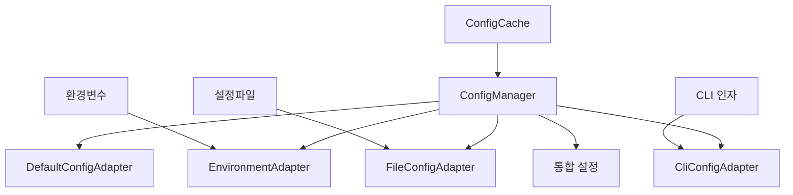

# 환경 설정 시스템 가이드

## 📖 개요

deps-cli는 어댑터 패턴 기반의 고도화된 환경 설정 시스템을 제공합니다. 이 시스템은 여러 설정 소스를 통합하고, 캐싱, 검증, 복구 기능을 포함한 완전한 설정 관리 솔루션입니다.

## 🏗️ 아키텍처

### 어댑터 패턴 구조



### 우선순위 순서

1. **CLI 인자** (최고 우선순위)
2. **설정 파일**
3. **환경 변수**
4. **기본값** (최저 우선순위)

## 📝 설정 파일 형태

### 지원하는 환경 변수

#### Notion API 설정
```bash
NOTION_API_KEY=secret_your_43_character_api_key_here_1234567890
NOTION_DATABASE_ID=12345678-1234-1234-1234-123456789abc
NOTION_PAGE_ID=87654321-4321-4321-4321-cba987654321
NOTION_API_VERSION=2022-06-28
```

#### 분석 엔진 설정
```bash
DEPS_CLI_MAX_CONCURRENCY=4        # 1-100 범위
DEPS_CLI_TIMEOUT=30000             # 1000-300000ms 범위
DEPS_CLI_CACHE_ENABLED=true
DEPS_CLI_CACHE_TTL=3600000         # 60000-86400000ms 범위
```

#### 로깅 설정
```bash
DEPS_CLI_LOG_LEVEL=info            # debug, info, warn, error
DEPS_CLI_LOG_FORMAT=text           # json, text
DEPS_CLI_LOG_ENABLED=true
```

#### 출력 설정
```bash
DEPS_CLI_DEFAULT_FORMAT=summary    # json, summary
DEPS_CLI_DEFAULT_OUTPUT_DIR=./results
DEPS_CLI_COMPRESSION=false
```

#### 개발 환경 설정
```bash
DEPS_CLI_VERBOSE=false
DEPS_CLI_DEBUG=false
DEPS_CLI_MOCK_API=false
NODE_ENV=production
```

## 🔧 사용 방법

### 기본 사용법

```bash
# 환경 변수 설정
export DEPS_CLI_DEFAULT_FORMAT=json
export DEPS_CLI_DEBUG=true

# CLI 실행
node dist/bin.js analyze src/
```

### 고급 사용법

```bash
# 디버그 모드로 설정 확인
DEPS_CLI_DEBUG=true node dist/bin.js analyze src/

# 여러 환경 변수 조합
DEPS_CLI_DEFAULT_FORMAT=json \
DEPS_CLI_VERBOSE=true \
DEPS_CLI_MAX_CONCURRENCY=8 \
node dist/bin.js classify .
```

### 설정 파일 사용

```bash
# 설정 파일 지정
node dist/bin.js analyze src/ --config ./custom-config.json
```

## 🔍 검증 시스템

### 자동 검증 규칙

#### Notion API 키
- **형식**: `secret_` + 43자 영숫자
- **길이**: 정확히 50자
- **예시**: `secret_1234567890abcdef1234567890abcdef1234567890`

#### Database/Page ID
- **형식**: 32자 헥사데시말 (하이픈 허용)
- **예시**: `12345678-1234-1234-1234-123456789abc`

#### 숫자 값 범위
- `maxConcurrency`: 1-100
- `timeout`: 1000-300000ms
- `cacheTtl`: 60000-86400000ms (1분-24시간)

#### 경로 보안
- 상위 디렉토리 참조(`..`) 금지
- 특수 문자(`<>:"|?*`) 금지

### 검증 실패 시 동작

```typescript
// 검증 실패 예시
{
  "error": "NOTION_API_KEY: Invalid Notion API key format",
  "recommendation": "API key must start with 'secret_' and be 50 characters long"
}
```

## 💾 캐싱 시스템

### 캐시 구조

```typescript
interface CacheEntry {
  config: EnvironmentConfigWithMetadata
  timestamp: number
  hash: string
  ttl: number
}
```

### 캐시 키 생성

캐시 키는 다음 요소들을 조합하여 생성됩니다:

```typescript
// 예시: "config|file:./config.json|cli:format:json,verbose:true|env:abc123def"
const cacheKey = [
  'config',
  options.configFile ? `file:${options.configFile}` : null,
  options.cliArgs ? `cli:${sortedCliArgs}` : null,
  `env:${environmentHash}`
].filter(Boolean).join('|')
```

### 캐시 무효화 조건

1. **환경 변수 변경**: 관련 환경 변수가 변경될 때
2. **TTL 만료**: 기본 5분 후 자동 만료
3. **수동 무효화**: `invalidateCache()` 호출 시
4. **메모리 한계**: LRU 방식으로 오래된 항목 제거

### 캐시 관리 API

```typescript
// 캐시 통계 조회
const stats = globalConfig.getCacheStats()
console.log(stats)
// {
//   memorySize: 3,
//   maxSize: 5,
//   entries: [...],
//   options: {...}
// }

// 캐시 정리
globalConfig.cleanupCache()

// 캐시 무효화
await globalConfig.invalidateCache('specific-key')
await globalConfig.invalidateCache() // 전체 무효화
```

## 🛠️ 에러 처리 및 복구

### 재시도 메커니즘

```typescript
// 기본 3회 재시도, 지수 백오프
const config = await globalConfig.loadWithRetry({
  cliArgs: options,
  validateConfig: true
}, 3, 1000)
```

### 폴백 시스템

1. **1차 폴백**: DefaultConfigAdapter로 기본 설정 로드
2. **2차 폴백**: 하드코딩된 최소 설정 사용

```typescript
// 하드코딩 폴백 설정
const fallbackConfig = {
  analysis: { maxConcurrency: 4, timeout: 30000 },
  logging: { level: 'info', format: 'text', enabled: true },
  output: { defaultFormat: 'summary', compression: false },
  development: { verbose: false, debugMode: false, mockApiCalls: false }
}
```

### 자동 복구

```typescript
const recovery = await globalConfig.autoRecover()
if (recovery.success) {
  console.log('복구 성공:', recovery.actions)
} else {
  console.log('복구 실패:', recovery.actions)
}
```

## 📊 진단 및 모니터링

### 시스템 진단

```typescript
const diagnosis = await globalConfig.diagnose()
console.log(diagnosis)
// {
//   isHealthy: true,
//   issues: [],
//   recommendations: [],
//   adapters: [
//     { name: 'default', status: 'ok' },
//     { name: 'env', status: 'warning', message: 'Some validation issues' }
//   ]
// }
```

### 메타데이터 추적

모든 설정값은 다음 메타데이터와 함께 추적됩니다:

```typescript
interface ConfigMetadata {
  source: 'default' | 'env' | 'file' | 'cli' | 'runtime'
  raw?: string              // 원본 값
  parsed?: any             // 파싱된 값
  isValid: boolean         // 검증 결과
  error?: string           // 에러 메시지
  timestamp?: string       // 생성 시간
}
```

## 🚀 성능 최적화

### 지연 로딩 (Lazy Loading)

```typescript
// 어댑터는 실제 사용 시점에 초기화
private initializeAdapters(): void {
  if (this.adapters.length === 0) {
    this.adapters = [
      new DefaultConfigAdapter(),
      new EnvironmentAdapter()
    ]
  }
}
```

### 병렬 처리

```typescript
// 모든 어댑터에서 병렬로 설정 로드
const loadResults = await Promise.allSettled(
  adapters.map(adapter => this.loadFromAdapter(adapter))
)
```

### 싱글톤 패턴

```typescript
// 전역에서 단일 인스턴스 사용
export const globalConfig = ConfigManager.getInstance()
```

## 🔒 보안 고려사항

### 민감한 정보 마스킹

```typescript
// API 키 자동 마스킹
const maskedKey = "secr****************************5678"

// 로그에서 민감한 정보 제거
const safeConfig = globalConfig.dumpSafe()
```

### 경로 검증

```typescript
// 상위 디렉토리 접근 차단
if (path.includes('..')) {
  throw new Error('Path cannot contain ".." references')
}
```

## 🧪 테스트 및 검증

### 설정 검증 테스트

```bash
# 환경 변수 검증
NOTION_API_KEY=invalid_key npm test

# 설정 로딩 테스트
npm test -- --grep "ConfigManager"
```

### 디버그 모드 활용

```bash
# 상세한 설정 정보 출력
DEPS_CLI_DEBUG=true node dist/bin.js analyze src/
```

## 📚 예제 시나리오

### 시나리오 1: 개발 환경 설정

```bash
export NODE_ENV=development
export DEPS_CLI_DEBUG=true
export DEPS_CLI_VERBOSE=true
export DEPS_CLI_LOG_LEVEL=debug

node dist/bin.js analyze src/
```

### 시나리오 2: 프로덕션 환경 설정

```bash
export NODE_ENV=production
export DEPS_CLI_DEFAULT_FORMAT=json
export DEPS_CLI_COMPRESSION=true
export DEPS_CLI_CACHE_ENABLED=true

node dist/bin.js classify . --output-dir ./production-results
```

### 시나리오 3: CI/CD 환경 설정

```bash
export DEPS_CLI_MAX_CONCURRENCY=8
export DEPS_CLI_TIMEOUT=60000
export DEPS_CLI_LOG_FORMAT=json

node dist/bin.js analyze . --format json > analysis-results.json
```

## 🔧 문제 해결

### 일반적인 문제들

#### 1. 설정 로딩 실패
```bash
# 진단 실행
node -e "
const { globalConfig } = require('./dist/config/ConfigManager.js')
globalConfig.diagnose().then(d => console.log(JSON.stringify(d, null, 2)))
"
```

#### 2. 캐시 문제
```bash
# 캐시 정리
node -e "
const { globalConfig } = require('./dist/config/ConfigManager.js')
globalConfig.cleanupCache()
console.log('Cache cleaned')
"
```

#### 3. 환경 변수 검증 실패
```bash
# 상세한 에러 정보 확인
DEPS_CLI_DEBUG=true node dist/bin.js analyze src/
```

이 가이드를 통해 deps-cli의 환경 설정 시스템을 완전히 이해하고 효과적으로 활용할 수 있습니다.