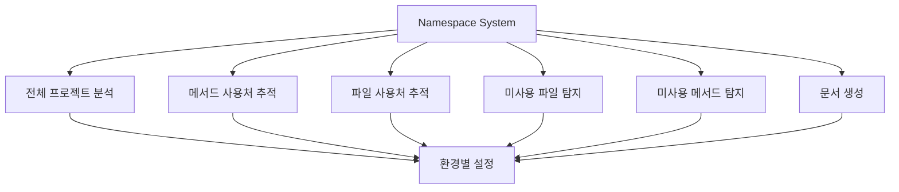
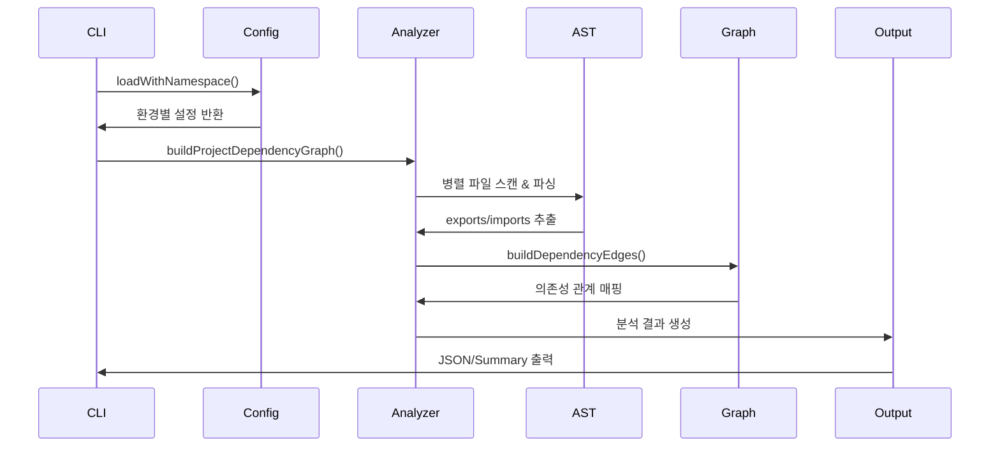
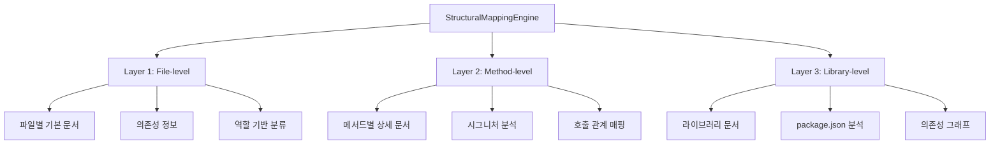
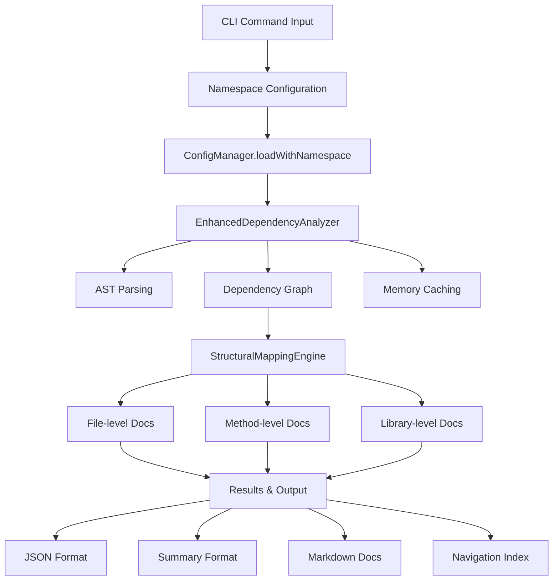

# deps-cli 데이터 플로우 아키텍처 완전 분석

## 📋 목차

- [1. 개요](#1-개요)
- [2. 네임스페이스 시스템](#2-네임스페이스-시스템)
- [3. 전체 프로젝트 분석](#3-전체-프로젝트-분석)
- [4. 메서드 사용처 추적](#4-메서드-사용처-추적)
- [5. 파일 사용처 추적](#5-파일-사용처-추적)
- [6. 마크다운 문서 시스템](#6-마크다운-문서-시스템)
- [7. 통합 데이터 플로우](#7-통합-데이터-플로우)
- [8. 성능 최적화](#8-성능-최적화)

## 1. 개요

deps-cli는 **AST 기반 고정밀도 의존성 분석**을 통한 TypeScript/JavaScript 프로젝트 관리 도구로, 다음 5가지 핵심 기능의 데이터 플로우를 체계적으로 관리합니다:

### 🎯 핵심 기능

1. **전체 프로젝트 분석** (`analyze-enhanced`)
2. **메서드 사용처 추적** (`find-method-usages-enhanced`)
3. **특정 파일 사용처 추적** (`find-usages-enhanced`)
4. **미사용 파일/메서드 탐지** (`find-unused-*-enhanced`)
5. **3-tier 마크다운 문서 생성** (StructuralMappingEngine)

### 🏗️ 아키텍처 원칙

- **AST 기반**: 정규식 대신 Abstract Syntax Tree 사용으로 99%+ 정확도
- **네임스페이스 기반**: 환경별 설정 관리 (development, production, staging)
- **병렬 처리**: 대규모 프로젝트를 위한 성능 최적화
- **메모리 캐싱**: 중복 파싱 방지로 성능 향상
- **모듈화**: 각 컴포넌트의 독립적 동작 보장

## 2. 네임스페이스 시스템

### 2.1 네임스페이스 영향 범위

네임스페이스는 deps-cli의 **모든 분석 기능**에 영향을 줍니다:



### 2.2 네임스페이스 데이터 플로우

```typescript
// 1. CLI 명령어에서 namespace 지정
deps-cli --namespace production analyze-enhanced .

// 2. ConfigManager에서 namespace 기반 설정 로드
ConfigManager.loadWithNamespace()
  ↓
loadNamespacedConfig()
  ↓
namespaces[targetNamespace] 설정 반환

// 3. 환경별 설정 적용
development: {
  verbose: true,
  debugMode: true,
  maxConcurrency: 4
}

production: {
  verbose: false,
  maxConcurrency: 8,
  timeout: 60000
}

staging: {
  mockApiCalls: true,
  debugMode: false
}
```

### 2.3 설정 우선순위

```
CLI Arguments (최고 우선순위)
    ↓
File Config (namespace 지정)
    ↓
Environment Variables
    ↓
Default Config (최저 우선순위)
```

## 3. 전체 프로젝트 분석

### 3.1 analyze-enhanced 명령어 플로우



### 3.2 상세 데이터 플로우

```
🚀 Entry Point: bin.ts analyze-enhanced 명령어
    ↓
📋 1. Configuration Phase
    ConfigManager.loadWithNamespace(namespace)
    → 환경별 설정 로드 (maxConcurrency, timeout 등)
    ↓
🔍 2. File Discovery Phase
    EnhancedDependencyAnalyzer.getAllProjectFiles()
    → glob 패턴으로 .ts/.js/.tsx/.jsx 파일 스캔
    → excludePatterns 적용 (node_modules, .git 등 제외)
    ↓
⚡ 3. Parallel AST Parsing Phase
    buildProjectDependencyGraph()
    → collectAllExports() // 병렬로 모든 export 수집
    → collectAllImports() // 병렬로 모든 import 수집
    → parseWithCache() // 메모리 캐싱으로 중복 파싱 방지
    ↓
🕸️ 4. Dependency Graph Construction
    buildDependencyEdges()
    → import 경로를 절대 경로로 해석
    → 파일 간 의존성 관계 매핑
    → identifyEntryPoints() // package.json, bin 등에서 엔트리 포인트 자동 감지
    ↓
📊 5. Analysis & Results Generation
    → 의존성 통계 생성
    → 순환 의존성 감지
    → 미사용 파일/메서드 탐지
    → JSON/Summary 형식으로 결과 출력
```

### 3.3 핵심 컴포넌트

#### EnhancedDependencyAnalyzer 주요 메서드

```typescript
class EnhancedDependencyAnalyzer {
  // 프로젝트 전체 의존성 그래프 구축
  async buildProjectDependencyGraph(): Promise<DependencyGraph>

  // 모든 export 수집 (병렬 처리)
  private async collectAllExports(): Promise<Map<string, ExportInfo[]>>

  // 모든 import 수집 (병렬 처리)
  private async collectAllImports(): Promise<Map<string, ImportInfo[]>>

  // 의존성 관계 매핑
  private buildDependencyEdges(): void

  // 엔트리 포인트 자동 감지
  private identifyEntryPoints(): string[]
}
```

## 4. 메서드 사용처 추적

### 4.1 find-method-usages-enhanced 플로우

```
🎯 Entry Point: find-method-usages-enhanced <className> <methodName>
    ↓
📋 1. Configuration & Validation
    → namespace 기반 설정 로드
    → className, methodName 파라미터 검증
    ↓
🔍 2. Target Method Discovery
    EnhancedDependencyAnalyzer.findMethodReferences()
    → 프로젝트 전체 파일 스캔
    → AST 파싱으로 타겟 메서드 정의 위치 찾기
    ↓
⚡ 3. Usage Pattern Analysis
    → AST 노드 순회하여 메서드 호출 패턴 탐지
    → CallExpression, MemberExpression 분석
    → 클래스 인스턴스를 통한 호출 vs 정적 호출 구분
    ↓
🕸️ 4. Cross-Reference Mapping
    findFilesUsingMethodFromGraph()
    → 의존성 그래프를 활용한 효율적 검색
    → import 관계를 통해 가능한 사용처만 검색
    → 호출 컨텍스트 정보 수집 (라인 번호, 호출 방식)
    ↓
📊 5. Results Compilation
    → 사용처별 상세 정보 수집
    → 파일 경로, 라인 번호, 호출 컨텍스트
    → JSON/Summary 형식으로 출력
```

### 4.2 AST 기반 메서드 탐지

```typescript
// 메서드 호출 패턴 분석
interface MethodCallPattern {
  // 직접 호출: obj.method()
  directCall: CallExpression

  // 체이닝 호출: obj.method().anotherMethod()
  chainedCall: MemberExpression

  // 정적 호출: ClassName.staticMethod()
  staticCall: CallExpression

  // 구조분해 할당: const { method } = obj
  destructuredAccess: ObjectPattern
}
```

### 4.3 성능 최적화

- **의존성 그래프 활용**: 불필요한 파일 스캔 방지
- **AST 캐싱**: 동일 파일 재파싱 방지
- **선택적 분석**: import 관계가 있는 파일만 검사

## 5. 파일 사용처 추적

### 5.1 find-usages-enhanced 플로우

```
📁 Entry Point: find-usages-enhanced <filePath>
    ↓
📋 1. Configuration & Path Resolution
    → namespace 설정 로드
    → 상대/절대 경로를 절대 경로로 정규화
    → 파일 존재 여부 확인
    ↓
🔍 2. Reverse Dependency Search
    findFilesUsingTargetFromGraph()
    → 기존 의존성 그래프에서 역방향 검색
    → import/require 문에서 타겟 파일 참조하는 파일들 탐지
    ↓
⚡ 3. Import Statement Analysis
    extractImportsFromFile()
    → 각 파일의 AST에서 import 문 분석
    → import 경로 해석 (.js → .ts 매핑 포함)
    → named import vs default import vs namespace import 구분
    ↓
🕸️ 4. Usage Context Collection
    → import된 심볼들의 실제 사용 위치 추적
    → 변수 할당, 함수 호출, 타입 어노테이션 등
    → 사용 빈도 및 사용 패턴 분석
    ↓
📊 5. Impact Analysis
    → 타겟 파일 변경 시 영향받을 파일들 식별
    → 의존성 체인 깊이 분석
    → 리팩토링 영향도 평가
```

### 5.2 경로 해석 시스템

```typescript
// TypeScript/JavaScript 경로 매핑
interface PathResolution {
  // .js → .ts 파일 매핑
  '.js': ['.ts', '.tsx', '.js', '.jsx']

  // 상대 경로 해석
  './file': './file.ts' | './file/index.ts'

  // 절대 경로 해석
  '@/utils': 'src/utils' // tsconfig.json paths 지원

  // node_modules 해석
  'lodash': 'node_modules/lodash/index.js'
}
```

## 6. 마크다운 문서 시스템

### 6.1 3-Tier 문서 생성 아키텍처



### 6.2 문서 생성 데이터 플로우

```
📚 Entry Point: StructuralMappingEngine.processDependencyGraph()
    ↓
🏗️ 1. Three-Tier Node Creation
    Layer 1: File-level Nodes
    → createFileNodes() // 각 소스 파일에 대한 기본 문서
    → RoleClassifier로 파일 역할 분류 (service, config, test 등)
    → MirrorPathMapper로 문서 경로 매핑

    Layer 2: Method-level Nodes
    → createMethodNodes() // 메서드/함수/클래스별 상세 문서
    → MethodAnalyzer로 메서드 시그니처 분석
    → 복잡도 계산 및 호출 관계 매핑

    Layer 3: Library-level Nodes
    → createLibraryNodes() // 외부 라이브러리 문서
    → LibraryAnalyzer로 package.json 분석
    → 의존성 그래프 및 버전 정보 수집
    ↓
🆔 2. ID Management & Registry
    IdRegistry.registerNode()
    → 다중 ID 생성 전략 (Readable, Semantic, Role-based 등)
    → 충돌 감지 및 해결
    → 크로스 레퍼런스 링크 생성
    ↓
🗺️ 3. Path Mapping & Organization
    MirrorPathMapper.getDocumentPath()
    → 100% 결정적 경로 매핑
    → 환경별 문서 디렉토리 (dev-docs, prod-docs, test-env)
    → 역할별 하위 디렉토리 구성
    ↓
📝 4. Markdown Generation
    MarkdownGenerator.generateStructuredMarkdown()
    → 메타데이터 포함 마크다운 생성
    → 상호 참조 링크 자동 생성
    → 의존성 다이어그램 삽입
    ↓
🧭 5. Navigation System
    DocumentNavigator.buildNavigationIndex()
    → 문서 간 네비게이션 인덱스 구축
    → 검색 가능한 메타데이터 추출
    → 브레드크럼 네비게이션 생성
```

### 6.3 문서 구조

```
docs/
├── dev-docs/          # 개발 환경 문서
├── prod-docs/         # 프로덕션 환경 문서
├── test-env/          # 테스트 환경 문서
└── production/        # 배포용 문서
    ├── files/         # 파일별 문서 (Layer 1)
    │   ├── file_[hash]_[readable].md
    │   └── ...
    ├── methods/       # 메서드별 문서 (Layer 2)
    │   ├── [class]/[method].md
    │   └── ...
    ├── classes/       # 클래스별 문서 (Layer 2)
    │   ├── [namespace]/[class].md
    │   └── ...
    ├── libraries/     # 라이브러리별 문서 (Layer 3)
    │   ├── [library-name].md
    │   └── ...
    ├── modules/       # 모듈별 문서 (Layer 3)
    │   ├── [module-path].md
    │   └── ...
    ├── service/       # 서비스 계층 문서
    ├── config/        # 설정 관련 문서
    ├── test/          # 테스트 관련 문서
    └── script/        # 스크립트 문서
```

### 6.4 ID 관리 시스템

```typescript
// 다중 ID 생성 전략
interface IdStrategies {
  readable: string      // "config-manager-service"
  hierarchical: string  // "src-config-config-manager"
  contextual: string    // "src-config-config-manager-ts"
  semantic: string      // "config-manager"
  roleBased: string     // "service-config-manager"
  legacy: string        // "file_abc123_def456"
}

// ID 충돌 해결
class IdRegistry {
  registerNode(id: string, metadata: NodeMetadata): string
  resolveConflict(id: string, existingIds: Set<string>): string
  generateCrossReference(sourceId: string, targetId: string): Link
}
```

## 7. 통합 데이터 플로우

### 7.1 전체 시스템 연동



### 7.2 통합 플로우 상세

```
🎯 CLI Command Input
    ↓
📋 Namespace-based Configuration
    ConfigManager → 환경별 설정 로드
    ↓
🔍 Core Analysis Engine
    EnhancedDependencyAnalyzer
    ├── AST 파싱 (99%+ 정확도)
    ├── 의존성 그래프 구축
    ├── 엔트리 포인트 자동 감지
    └── 메모리 캐싱 최적화
    ↓
🗺️ Mapping & Documentation
    StructuralMappingEngine
    ├── 3-Tier 노드 생성
    ├── ID 관리 및 충돌 해결
    ├── 경로 매핑 및 조직화
    └── 마크다운 문서 생성
    ↓
📊 Results & Output
    ├── JSON 형식 (machine-readable)
    ├── Summary 형식 (human-readable)
    ├── 문서 파일 (markdown)
    └── 네비게이션 인덱스
```

### 7.3 데이터 흐름 최적화

#### 병렬 처리 전략

```typescript
// 동시 실행되는 작업들
await Promise.all([
  collectAllExports(),    // 모든 export 수집
  collectAllImports(),    // 모든 import 수집
  scanProjectFiles(),     // 프로젝트 파일 스캔
  loadConfiguration()     // 설정 로드
])

// 순차 실행이 필요한 작업들
const dependencyGraph = await buildDependencyGraph()
const mappingNodes = await createMappingNodes(dependencyGraph)
const documents = await generateDocuments(mappingNodes)
```

#### 메모리 관리

```typescript
class PerformanceOptimization {
  // AST 파싱 캐시
  private parseCache = new Map<string, AST>()

  // 경로 해석 캐시
  private pathCache = new Map<string, string>()

  // 설정 캐시
  private configCache = new ConfigCache()

  // 메모리 정리
  clearCache(): void
}
```

## 8. 성능 최적화

### 8.1 성능 지표

```
📊 Performance Metrics (v2.0.0)
├── 분석 속도: ~0.4초 (30+ 파일 프로젝트)
├── 정확도: 99%+ (AST 기반)
├── 메모리 사용량: 최적화된 캐싱
└── 확장성: 대규모 프로젝트 지원
```

### 8.2 최적화 전략

#### 1. 병렬 처리
```typescript
// 파일별 병렬 분석
const analysisPromises = files.map(file =>
  analyzeFileInParallel(file, config)
)
const results = await Promise.all(analysisPromises)
```

#### 2. 지능형 캐싱
```typescript
// 다층 캐싱 시스템
class CachingStrategy {
  // Level 1: 메모리 캐시 (빠른 접근)
  private memoryCache = new Map()

  // Level 2: 파일 캐시 (세션 간 유지)
  private fileCache = new FileCache()

  // Level 3: 설정 캐시 (네임스페이스별)
  private configCache = new ConfigCache()
}
```

#### 3. 지연 로딩
```typescript
// 필요한 시점에만 리소스 로드
class LazyLoading {
  private async loadAnalyzer(): Promise<EnhancedDependencyAnalyzer> {
    return import('./EnhancedDependencyAnalyzer.js')
  }

  private async loadMapper(): Promise<StructuralMappingEngine> {
    return import('./StructuralMappingEngine.js')
  }
}
```

### 8.3 확장성 고려사항

#### 모듈화 설계
```typescript
interface AnalysisModule {
  analyze(input: AnalysisInput): Promise<AnalysisResult>
  supports(fileType: string): boolean
  getConfig(): ModuleConfig
}

// 플러그인 시스템
class PluginManager {
  registerAnalyzer(analyzer: AnalysisModule): void
  getAnalyzer(fileType: string): AnalysisModule
}
```

#### API 호환성
```typescript
// 일관된 인터페이스 제공
interface UnifiedAPI {
  analyze(options: AnalysisOptions): Promise<AnalysisResult>
  findUsages(target: string): Promise<UsageResult>
  generateDocs(config: DocConfig): Promise<DocumentResult>
}
```

## 📚 관련 문서

- [CLI 명령어 가이드](./DEPENDENCY_ANALYSIS_COMMANDS.md)
- [Enhanced 시스템](./ENHANCED_DEPENDENCY_ANALYSIS.md)
- [성능 분석](./ENHANCED_PERFORMANCE_COMPARISON.md)
- [아키텍처 설계](./ARCHITECTURE.md)
- [네임스페이스 설정](./NAMESPACE_CONFIGURATION.md)

---

**deps-cli v2.0.0** - 🚀 AST 기반 99%+ 정확도 의존성 분석 시스템

*마지막 업데이트: 2025-09-27*