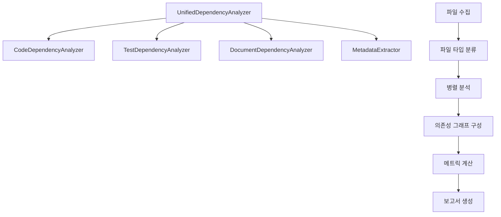

# 의존성 분석 및 파싱 시스템 가이드

## 📖 개요

deps-cli는 TypeScript/JavaScript 프로젝트의 의존성을 종합적으로 분석하는 고도화된 시스템을 제공합니다. 이 가이드는 파일 파싱, 의존성 추출, 그래프 구성, 분석 결과 생성의 전체 과정을 상세히 설명합니다.

## 🏗️ 분석 아키텍처

### 핵심 구조



### 분석기 역할

| 분석기 | 담당 파일 | 추출 정보 |
|--------|-----------|-----------|
| **CodeDependencyAnalyzer** | `.ts`, `.tsx`, `.js`, `.jsx` | import/export, 모듈 의존성 |
| **TestDependencyAnalyzer** | `.test.ts`, `.spec.js` | 테스트 대상, 모킹, 유틸리티 |
| **DocumentDependencyAnalyzer** | `.md`, `.rst`, `.txt` | 링크, 참조, 에셋 |
| **MetadataExtractor** | 모든 파일 | 복잡도, 크기, 메타데이터 |

## 🔍 파일 분류 시스템

### 자동 파일 타입 감지

```typescript
private getNodeType(filePath: string): NodeType {
  const normalizedPath = filePath.toLowerCase()

  // 테스트 파일 패턴
  if (
    normalizedPath.includes(".test.") ||
    normalizedPath.includes(".spec.") ||
    normalizedPath.includes("/__tests__/") ||
    normalizedPath.includes("/test/") ||
    normalizedPath.includes("/tests/")
  ) {
    return "test"
  }

  // 문서 파일 패턴
  if (
    normalizedPath.endsWith(".md") ||
    normalizedPath.endsWith(".markdown") ||
    normalizedPath.endsWith(".rst") ||
    normalizedPath.endsWith(".txt")
  ) {
    return "docs"
  }

  // 라이브러리 파일 (node_modules)
  if (normalizedPath.includes("node_modules")) {
    return "library"
  }

  // 코드 파일 패턴
  if (
    normalizedPath.endsWith(".ts") ||
    normalizedPath.endsWith(".tsx") ||
    normalizedPath.endsWith(".js") ||
    normalizedPath.endsWith(".jsx") ||
    normalizedPath.endsWith(".vue") ||
    normalizedPath.endsWith(".svelte")
  ) {
    return "code"
  }

  return "code" // 기본값
}
```

### 파일 타입별 처리

1. **Code Files**: ES6 import/export, CommonJS require 파싱
2. **Test Files**: 테스트 프레임워크별 패턴 인식
3. **Docs Files**: Markdown 링크, 이미지 참조 추출
4. **Library Files**: 외부 의존성으로 분류

## 📊 의존성 파싱 로직

### Import 문 파싱

```typescript
// 지원하는 Import 패턴들
import { Component } from 'react'                    // Named import
import React from 'react'                           // Default import
import * as utils from './utils'                    // Namespace import
import type { TypeDef } from './types'              // Type-only import
const module = require('./module')                  // CommonJS require
const { helper } = require('./helpers')             // Destructured require
import('./dynamic-module')                          // Dynamic import
```

### 의존성 분류 체계

```typescript
interface ClassifiedDependency {
  source: string              // 원본 import 문자열
  resolvedPath: string | null // 실제 파일 경로
  exists: boolean            // 파일 존재 여부
  line: number              // 소스 코드 라인 번호
  confidence: number        // 분석 신뢰도 (0-1)
  type: DependencyType      // 의존성 타입
  importType: ImportType    // Import 방식
  isTypeOnly: boolean       // 타입 전용 import 여부
  exportedMembers: string[] // Export된 멤버들
  usage: 'runtime' | 'build-time' | 'type-only'
}
```

### 의존성 타입 분류

```typescript
type DependencyType =
  | 'internal-module'    // 프로젝트 내부 모듈
  | 'external-library'   // 외부 npm 패키지
  | 'builtin-module'     // Node.js 내장 모듈
  | 'test-utility'       // 테스트 유틸리티
  | 'document-reference' // 문서 참조
  | 'asset-reference'    // 에셋 파일 참조
```

## 🎯 분석 프로세스

### 1단계: 파일 수집 및 분류

```typescript
async analyzeProject(files: Array<string>): Promise<UnifiedAnalysisResult> {
  // 파일 타입별 그룹화
  const fileGroups = this.groupFilesByType(files)

  // 노드 맵 초기화
  const nodes = new Map<string, DependencyNode>()

  // 각 파일 타입별 병렬 분석
  const [testResults, docResults, codeResults] = await Promise.all([
    this.analyzeTestFiles(fileGroups.test, nodes, warnings),
    this.analyzeDocumentFiles(fileGroups.docs, nodes, warnings),
    this.analyzeCodeFiles(fileGroups.code, nodes, warnings)
  ])
}
```

### 2단계: 의존성 노드 생성

각 파일은 DependencyNode로 변환됩니다:

```typescript
interface DependencyNode {
  filePath: string              // 절대 경로
  nodeType: NodeType           // 파일 타입
  relativePath: string         // 프로젝트 상대 경로
  size: number                 // 파일 크기 (bytes)
  lastModified: Date          // 마지막 수정일
  language: string            // 프로그래밍 언어
  framework?: string          // 프레임워크 (React, Vue 등)
  metadata: {                 // 메타데이터
    complexity?: number       // 복잡도 점수
    maintainability?: number  // 유지보수성 점수
    testCoverage?: number    // 테스트 커버리지
    documentation?: number   // 문서화 점수
  }
  dependencies: ClassifiedDependency[]  // 의존성 목록
  dependents: string[]                  // 역방향 의존성
  clusters: string[]                    // 클러스터 정보
  analysis: {                          // 분석 결과
    totalDependencies: number
    internalDependencies: number
    externalDependencies: number
    cyclicDependencies: string[]
    riskFactors: string[]
  }
}
```

### 3단계: 의존성 그래프 구성

```typescript
private buildDependencyGraph(nodes: Map<string, DependencyNode>): DependencyGraph {
  const edges: DependencyGraph["edges"] = []

  // 의존성 관계를 엣지로 변환
  for (const [filePath, node] of nodes.entries()) {
    for (const dep of node.dependencies) {
      const targetPath = dep.resolvedPath || dep.source

      if (nodes.has(targetPath)) {
        edges.push({
          from: filePath,
          to: targetPath,
          dependency: dep,
          weight: dep.confidence
        })

        // 역방향 dependents 관계 설정
        const targetNode = nodes.get(targetPath)!
        if (!targetNode.dependents.includes(filePath)) {
          targetNode.dependents.push(filePath)
        }
      }
    }
  }

  return {
    projectRoot: this.projectRoot,
    timestamp: new Date(),
    version: "1.0.0",
    nodes,
    edges,
    metrics: this.calculateGraphMetrics(nodes, edges),
    clusters: this.generateClusters(nodes)
  }
}
```

## 🧮 메트릭 계산

### 그래프 레벨 메트릭

```typescript
interface GraphMetrics {
  totalFiles: number                    // 전체 파일 수
  totalDependencies: number            // 전체 의존성 수
  averageDependenciesPerFile: number   // 파일당 평균 의존성
  cyclicDependencyCount: number        // 순환 의존성 수
  isolatedFileCount: number           // 고립된 파일 수
  maxDepth: number                    // 최대 의존성 깊이
}
```

### 복잡도 계산

```typescript
private calculateMaintainability(result: CodeAnalysisResult): number {
  let score = 1.0

  // 복잡도 패널티
  if (result.codeMetadata.complexity > 10) score -= 0.3

  // 파일 크기 패널티
  if (result.codeMetadata.linesOfCode > 300) score -= 0.2

  // 의존성 수 패널티
  if (result.externalLibraries.length > 20) score -= 0.1

  return Math.max(score, 0)
}
```

### 위험 요소 분석

```typescript
// 코드 파일 위험 요소
private calculateCodeRiskFactors(result: CodeAnalysisResult): Array<string> {
  const risks: Array<string> = []

  if (result.codeMetadata.complexity > 10) risks.push("high-complexity")
  if (result.codeMetadata.circularDependencies.length > 0) risks.push("circular-dependencies")
  if (result.codeMetadata.linesOfCode > 500) risks.push("large-file")
  if (result.externalLibraries.length > 30) risks.push("heavy-dependencies")

  return risks
}

// 테스트 파일 위험 요소
private calculateTestRiskFactors(result: TestAnalysisResult): Array<string> {
  const risks: Array<string> = []

  if (result.testMetadata.mockCount > 5) risks.push("heavy-mocking")
  if (result.testMetadata.assertionCount < 3) risks.push("insufficient-assertions")
  if (result.testTargets.length === 0) risks.push("no-test-targets")

  return risks
}
```

## 🎯 클러스터링 시스템

### 디렉토리 기반 클러스터링

```typescript
private generateClusters(nodes: Map<string, DependencyNode>): DependencyGraph["clusters"] {
  const clusters: Record<string, ClusterInfo> = {}

  // 디렉토리 기반 클러스터링
  for (const [filePath, node] of nodes.entries()) {
    if (node.nodeType !== "library") {
      const dirPath = path.dirname(node.relativePath)
      const clusterName = dirPath.split("/")[0] || "root"

      if (!clusters[clusterName]) {
        clusters[clusterName] = {
          name: clusterName,
          files: [],
          type: this.inferClusterType(clusterName),
          cohesion: 0,
          coupling: 0
        }
      }

      clusters[clusterName].files.push(filePath)
    }
  }

  return clusters
}
```

### 클러스터 타입 추론

```typescript
private inferClusterType(clusterName: string): ClusterType {
  const featurePatterns = ["components", "pages", "features"]
  const layerPatterns = ["services", "utils", "helpers", "config"]
  const domainPatterns = ["models", "entities", "domain"]
  const infraPatterns = ["infrastructure", "adapters", "providers"]

  if (featurePatterns.some(p => clusterName.includes(p))) return "feature"
  if (layerPatterns.some(p => clusterName.includes(p))) return "layer"
  if (domainPatterns.some(p => clusterName.includes(p))) return "domain"
  if (infraPatterns.some(p => clusterName.includes(p))) return "infrastructure"

  return "feature"
}
```

### 응집도/결합도 계산

```typescript
private calculateClusterMetrics(
  cluster: ClusterInfo,
  nodes: Map<string, DependencyNode>
): { cohesion: number; coupling: number } {
  const clusterFiles = new Set(cluster.files)
  let internalEdges = 0
  let externalEdges = 0

  for (const filePath of cluster.files) {
    const node = nodes.get(filePath)
    if (!node) continue

    for (const dep of node.dependencies) {
      const targetPath = dep.resolvedPath || dep.source
      if (clusterFiles.has(targetPath)) {
        internalEdges++  // 클러스터 내부 의존성
      } else {
        externalEdges++  // 클러스터 외부 의존성
      }
    }
  }

  const totalEdges = internalEdges + externalEdges
  const cohesion = totalEdges > 0 ? internalEdges / totalEdges : 0
  const coupling = totalEdges > 0 ? externalEdges / totalEdges : 0

  return { cohesion, coupling }
}
```

## 📈 분석 결과 구조

### 통합 분석 결과

```typescript
interface UnifiedAnalysisResult {
  graph: DependencyGraph           // 의존성 그래프
  report: DependencyReport         // 분석 보고서
  nodesByType: Map<NodeType, DependencyNode[]>  // 타입별 노드 분류
  analysisMetadata: {              // 분석 메타데이터
    startTime: Date
    endTime: Date
    duration: number               // 분석 소요 시간 (ms)
    filesProcessed: number         // 처리된 파일 수
    errorsCount: number           // 에러 발생 수
    warnings: string[]            // 경고 메시지들
  }
}
```

### 의존성 보고서

```typescript
interface DependencyReport {
  summary: {
    projectName: string
    analysisDate: Date
    fileTypes: {
      test: number
      code: number
      docs: number
      library: number
    }
    dependencyTypes: Record<string, number>
  }
  testAnalysis: {
    testFiles: number
    testedFiles: number
    testCoverage: number
    uncoveredFiles: string[]
    testDependencyGraph: Map<string, string[]>
  }
  codeAnalysis: {
    internalModules: number
    externalLibraries: number
    circularDependencies: string[]
    heaviestDependencies: Array<{file: string, count: number}>
    isolatedFiles: string[]
  }
  documentationAnalysis: {
    documentFiles: number
    brokenLinks: string[]
    orphanedDocs: string[]
    documentationGraph: Map<string, string[]>
  }
  recommendations: string[]
}
```

## 🔧 고급 분석 기능

### 순환 의존성 탐지

```typescript
private detectCircularDependencies(nodes: Map<string, DependencyNode>): string[] {
  const visited = new Set<string>()
  const recursionStack = new Set<string>()
  const cycles: string[] = []

  const dfs = (nodeKey: string, path: string[]): void => {
    if (recursionStack.has(nodeKey)) {
      // 순환 발견
      const cycleStart = path.indexOf(nodeKey)
      const cycle = path.slice(cycleStart).concat(nodeKey)
      cycles.push(cycle.join(' -> '))
      return
    }

    if (visited.has(nodeKey)) return

    visited.add(nodeKey)
    recursionStack.add(nodeKey)

    const node = nodes.get(nodeKey)
    if (node) {
      for (const dep of node.dependencies) {
        const targetPath = dep.resolvedPath || dep.source
        if (nodes.has(targetPath)) {
          dfs(targetPath, [...path, nodeKey])
        }
      }
    }

    recursionStack.delete(nodeKey)
  }

  for (const nodeKey of nodes.keys()) {
    if (!visited.has(nodeKey)) {
      dfs(nodeKey, [])
    }
  }

  return cycles
}
```

### 최대 의존성 깊이 계산

```typescript
private calculateMaxDepth(nodes: Map<string, DependencyNode>): number {
  const visited = new Set<string>()
  let maxDepth = 0

  const dfs = (nodeKey: string, depth: number): number => {
    if (visited.has(nodeKey)) return depth
    visited.add(nodeKey)

    const node = nodes.get(nodeKey)
    if (!node) return depth

    let currentMaxDepth = depth
    for (const dep of node.dependencies) {
      const targetPath = dep.resolvedPath || dep.source
      if (nodes.has(targetPath)) {
        currentMaxDepth = Math.max(currentMaxDepth, dfs(targetPath, depth + 1))
      }
    }

    return currentMaxDepth
  }

  for (const nodeKey of nodes.keys()) {
    if (!visited.has(nodeKey)) {
      maxDepth = Math.max(maxDepth, dfs(nodeKey, 0))
    }
  }

  return maxDepth
}
```

## 🎨 출력 형식

### JSON 출력

```json
{
  "graph": {
    "projectRoot": "/path/to/project",
    "timestamp": "2025-09-23T20:56:23.662Z",
    "nodes": {...},
    "edges": [...],
    "metrics": {...},
    "clusters": {...}
  },
  "report": {
    "summary": {...},
    "testAnalysis": {...},
    "codeAnalysis": {...},
    "documentationAnalysis": {...},
    "recommendations": [...]
  },
  "nodesByType": {
    "test": [...],
    "code": [...],
    "docs": [...],
    "library": [...]
  }
}
```

### 요약 출력

```
📈 Analysis Summary:
Files processed: 25
Analysis duration: 156ms
Dependencies: 47

📊 File Type Distribution:
  📄 Code: 18 files
  🧪 Test: 5 files
  📝 Docs: 2 files
  📦 Library: 12 packages

🔍 Dependency Analysis:
  Internal modules: 23
  External libraries: 12
  Circular dependencies: 0
  Isolated files: 1

⚠️ Risk Factors:
  High complexity files: 2
  Large files (>500 LOC): 1
  Heavy dependencies (>20): 0
```

## 🚀 성능 최적화

### 병렬 분석

```typescript
// 파일 타입별 병렬 분석
const [testResults, docResults, codeResults] = await Promise.all([
  this.analyzeTestFiles(fileGroups.test, nodes, warnings),
  this.analyzeDocumentFiles(fileGroups.docs, nodes, warnings),
  this.analyzeCodeFiles(fileGroups.code, nodes, warnings)
])
```

### 점진적 분석

```typescript
// 대용량 프로젝트를 위한 배치 처리
private async analyzeInBatches<T>(
  items: T[],
  batchSize: number,
  processor: (batch: T[]) => Promise<void>
): Promise<void> {
  for (let i = 0; i < items.length; i += batchSize) {
    const batch = items.slice(i, i + batchSize)
    await processor(batch)
  }
}
```

### 메모리 효율성

```typescript
// WeakMap을 사용한 메모리 효율적 캐싱
private readonly fileCache = new WeakMap<object, AnalysisResult>()

// 스트림 기반 대용량 파일 처리
private async analyzeStreamFile(filePath: string): Promise<AnalysisResult> {
  const stream = fs.createReadStream(filePath, { encoding: 'utf8' })
  // 스트림 기반 분석 로직...
}
```

이 가이드를 통해 deps-cli의 의존성 분석 시스템이 어떻게 파일을 파싱하고, 의존성을 추출하며, 복잡한 그래프 구조를 구성하는지 완전히 이해할 수 있습니다.