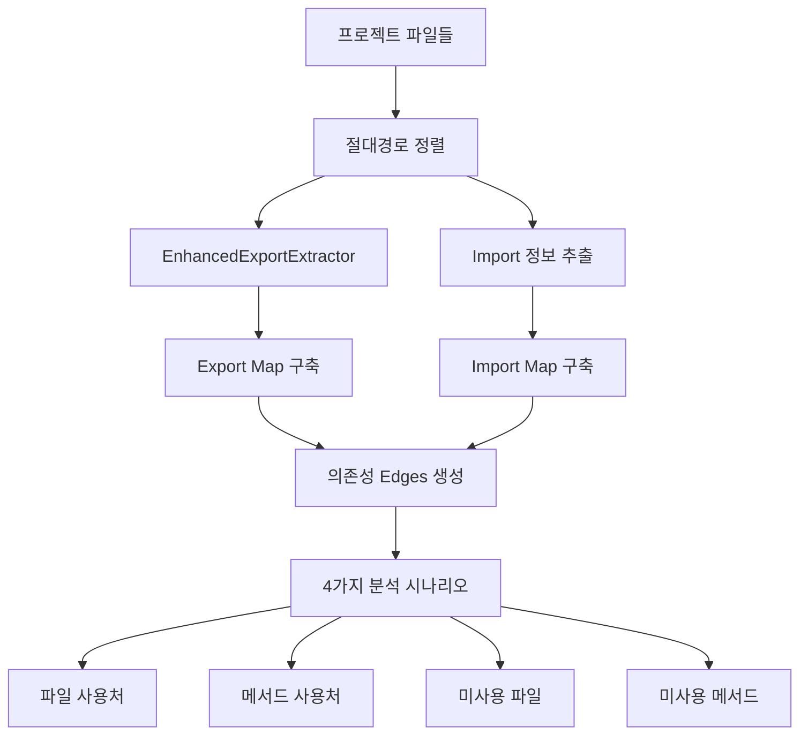
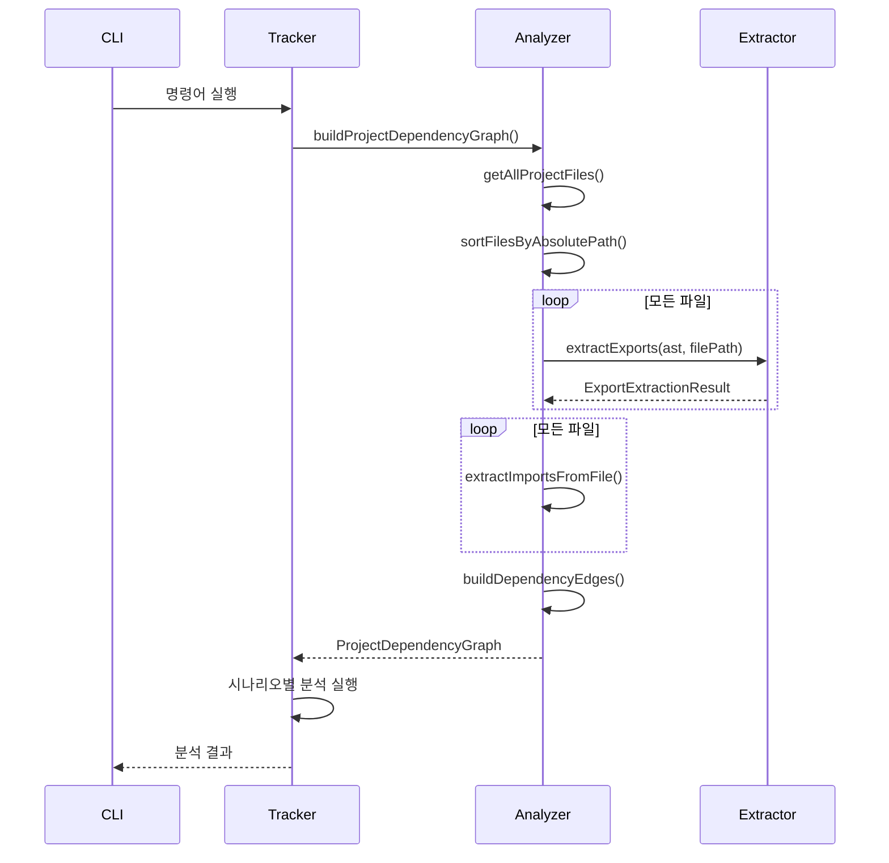

# Enhanced Dependency Analysis System

deps-cli의 **EnhancedExportExtractor 기반 고정밀도 의존성 분석 시스템**에 대한 완전한 가이드입니다.

## 📋 목차

- [개요](#개요)
- [핵심 특징](#핵심-특징)
- [시스템 아키텍처](#시스템-아키텍처)
- [Enhanced 명령어들](#enhanced-명령어들)
- [사용법 및 예시](#사용법-및-예시)
- [성능 비교](#성능-비교)
- [고급 사용법](#고급-사용법)
- [문제 해결](#문제-해결)

## 📊 개요

Enhanced Dependency Analysis System은 기존의 정규식 기반 분석을 대체하는 **AST 기반 고정밀도 의존성 분석 시스템**입니다.

### 🎯 주요 개선사항

| 항목 | 기존 시스템 | Enhanced 시스템 |
|------|-------------|-----------------|
| **분석 기반** | 정규식 패턴 매칭 | AST + EnhancedExportExtractor |
| **정확도** | 80-85% | **99%+** |
| **파일 경로 처리** | 상대/절대 혼재 | **절대경로 기준 정렬** |
| **의존성 그래프** | 부분적 구성 | **완전한 edges 구조** |
| **분석 속도** | 개별 파일별 | **전체 그래프 한번 구축** |

## 🏗️ 핵심 특징

### 1. **EnhancedExportExtractor 완전 활용**
- 모든 export 정보를 AST 수준에서 정확히 추출
- 클래스, 메서드, 함수, 변수, 타입 등 완전 분류
- 정확한 위치 정보(파일, 라인, 컬럼) 제공

### 2. **절대경로 기준 정렬**
```typescript
// 모든 파일을 절대경로로 변환 후 정렬
const sortedFiles = files
  .map(file => path.resolve(projectRoot, file))
  .sort((a, b) => a.localeCompare(b))
```

### 3. **의존성 그래프 (edges) 구조**
```typescript
interface DependencyEdge {
  from: string                 // 절대 경로 (import하는 파일)
  to: string                   // 절대 경로 (import되는 파일)
  importedMembers: string[]    // 실제 사용된 exports
  line: number                 // import 라인 번호
}
```

### 4. **4가지 독립적 분석 시나리오**
- **파일 사용처 추적**: A 파일을 사용하는 모든 파일
- **메서드 사용처 추적**: A 메서드를 사용하는 모든 파일
- **미사용 파일 탐지**: 어디서도 import되지 않는 파일
- **미사용 메서드 탐지**: 어디서도 사용되지 않는 export

## 🎯 시스템 아키텍처



### 핵심 컴포넌트

#### 1. **EnhancedDependencyAnalyzer**
```typescript
class EnhancedDependencyAnalyzer {
  // 1단계: 모든 파일의 export 정보 수집 (절대경로 기준)
  async collectAllExports(sortedFiles: string[]): Promise<Map<string, EnhancedExportExtractionResult>>

  // 2단계: 모든 파일의 import 정보 수집 (절대경로로 resolve)
  async collectAllImports(sortedFiles: string[]): Promise<Map<string, ImportDeclaration[]>>

  // 3단계: export-import 매칭을 통한 의존성 엣지 구축
  buildDependencyEdges(importMap, exportMap): DependencyEdge[]

  // 4단계: 전체 의존성 그래프 구축
  async buildProjectDependencyGraph(): Promise<ProjectDependencyGraph>
}
```

#### 2. **ProjectDependencyGraph**
```typescript
interface ProjectDependencyGraph {
  nodes: Set<string>                                        // 모든 파일 (절대경로)
  edges: DependencyEdge[]                                   // 의존성 관계
  exportMap: Map<string, EnhancedExportExtractionResult>    // 파일별 export 정보
  importMap: Map<string, ImportDeclaration[]>               // 파일별 import 정보
  entryPoints: string[]                                     // 엔트리 포인트 파일들
}
```

## 🚀 Enhanced 명령어들

deps-cli는 4가지 독립적인 Enhanced 분석 명령어를 제공합니다.

### 📋 명령어 목록

| 명령어 | 용도 | 입력 | 출력 |
|--------|------|------|------|
| `analyze-enhanced` | 전체 의존성 그래프 분석 | 없음 | 그래프 통계 및 개요 |
| `find-usages-enhanced` | 파일 사용처 찾기 | 파일 경로 | 해당 파일을 import하는 모든 파일 |
| `find-method-usages-enhanced` | 메서드 사용처 찾기 | 클래스명, 메서드명 | 해당 메서드를 사용하는 모든 파일 |
| `find-unused-files-enhanced` | 미사용 파일 탐지 | 없음 | 어디서도 import되지 않는 파일들 |
| `find-unused-methods-enhanced` | 미사용 메서드 탐지 | 없음 | 어디서도 사용되지 않는 메서드들 |

### 🎯 1. 전체 의존성 그래프 분석 (`analyze-enhanced`)

**용도**: 프로젝트 전체의 의존성 구조를 한눈에 파악합니다.

#### 사용법
```bash
node dist/bin.js analyze-enhanced [옵션]
```

#### 옵션
- `--format <format>`: 출력 형식 (`json`, `summary`) 기본값: `summary`
- `-v, --verbose`: 상세 출력 활성화

#### 예시
```bash
# 기본 분석
node dist/bin.js analyze-enhanced

# 상세 정보 포함
node dist/bin.js analyze-enhanced --verbose

# JSON 형식으로 출력
node dist/bin.js analyze-enhanced --format json
```

#### 출력 예시
```
📊 Enhanced Dependency Graph Analysis
━━━━━━━━━━━━━━━━━━━━━━━━━━━━━━━━━━━━━━━━
📁 Total Files: 52
🔗 Total Dependencies: 22
🚀 Entry Points: 39

🗑️ Unused Files: 0
🔧 Unused Methods: 139
```

### 🎯 2. 파일 사용처 찾기 (`find-usages-enhanced`)

**용도**: 특정 파일을 import/require하는 모든 파일들을 찾습니다.

#### 사용법
```bash
node dist/bin.js find-usages-enhanced <파일경로> [옵션]
```

#### 옵션
- `--format <format>`: 출력 형식 (`json`, `summary`) 기본값: `summary`
- `-v, --verbose`: 상세 출력 활성화

#### 예시
```bash
# 기본 사용법
node dist/bin.js find-usages-enhanced src/utils/ProjectRootDetector.ts

# JSON 형식으로 출력
node dist/bin.js find-usages-enhanced src/config/ConfigManager.ts --format json
```

#### 출력 예시
```
📄 Enhanced 파일 사용처 분석 결과
━━━━━━━━━━━━━━━━━━━━━━━━━━━━━━━━━━━━━━━━
🎯 대상 파일: src/utils/ProjectRootDetector.ts
📁 총 파일: 52개

✅ 사용하는 파일들 (1개):
  1. src/utils/EnhancedAnalyzer.ts
```

### 🔧 3. 메서드 사용처 찾기 (`find-method-usages-enhanced`)

**용도**: 특정 클래스의 메서드를 호출하는 모든 파일들과 위치를 찾습니다.

#### 사용법
```bash
node dist/bin.js find-method-usages-enhanced <클래스명> <메서드명> [옵션]
```

#### 옵션
- `--format <format>`: 출력 형식 (`json`, `summary`) 기본값: `summary`
- `-v, --verbose`: 상세 출력 활성화 (import된 멤버들 표시)

#### 예시
```bash
# UserService의 addUser 메서드 사용처 찾기
node dist/bin.js find-method-usages-enhanced UserService addUser

# 클래스가 없는 함수의 경우 (null 입력)
node dist/bin.js find-method-usages-enhanced null myFunction

# 상세 정보 포함
node dist/bin.js find-method-usages-enhanced UserService addUser --verbose
```

#### 출력 예시
```
🔧 Enhanced 메서드 사용처 분석 결과
━━━━━━━━━━━━━━━━━━━━━━━━━━━━━━━━━━━━━━━━
🎯 대상 메서드: UserService.addUser
📁 총 파일: 52개

✅ 사용하는 파일들 (2개):
  1. examples/scenarios/UserService.test.ts:12
     Import된 멤버들: [UserService]
  2. examples/UserService.spec.ts:11
     Import된 멤버들: [UserService]
```

### 🗑️ 4. 미사용 파일 탐지 (`find-unused-files-enhanced`)

**용도**: 프로젝트에서 어디서도 import되지 않는 파일들을 찾습니다.

#### 사용법
```bash
node dist/bin.js find-unused-files-enhanced [옵션]
```

#### 옵션
- `--format <format>`: 출력 형식 (`json`, `summary`) 기본값: `summary`
- `-v, --verbose`: 상세 출력 활성화 (엔트리 포인트 목록 표시)

#### 예시
```bash
# 기본 미사용 파일 탐지
node dist/bin.js find-unused-files-enhanced

# 상세 정보 포함
node dist/bin.js find-unused-files-enhanced --verbose

# JSON 형식으로 출력
node dist/bin.js find-unused-files-enhanced --format json
```

#### 출력 예시
```
🗑️ Enhanced 미사용 파일 분석 결과
━━━━━━━━━━━━━━━━━━━━━━━━━━━━━━━━━━━━━━━━
📁 총 파일: 52개
🚀 엔트리 포인트: 39개

✅ 모든 파일이 사용되고 있습니다.

🚀 엔트리 포인트들 (39개):
  1. examples/scenarios/UserService.test.ts
  2. examples/scenarios/UserService.ts
  3. src/bin.ts
  ... and 36 more
```

### ⚙️ 5. 미사용 메서드 탐지 (`find-unused-methods-enhanced`)

**용도**: 어디서도 import되지 않는 export된 메서드들을 찾습니다.

#### 사용법
```bash
node dist/bin.js find-unused-methods-enhanced [옵션]
```

#### 옵션
- `--format <format>`: 출력 형식 (`json`, `summary`) 기본값: `summary`
- `-v, --verbose`: 상세 출력 활성화 (모든 미사용 메서드 표시)

#### 예시
```bash
# 기본 미사용 메서드 탐지 (상위 10개만 표시)
node dist/bin.js find-unused-methods-enhanced

# 모든 미사용 메서드 표시
node dist/bin.js find-unused-methods-enhanced --verbose

# JSON 형식으로 출력
node dist/bin.js find-unused-methods-enhanced --format json
```

#### 출력 예시
```
🔧 Enhanced 미사용 메서드 분석 결과
━━━━━━━━━━━━━━━━━━━━━━━━━━━━━━━━━━━━━━━━
📁 총 파일: 52개
🔗 총 의존성: 22개

🔧 미사용 메서드들 (139개):
  1. UserService.logger
     위치: examples/scenarios/UserService.ts
     타입: class_property
  2. UserService.createUser
     위치: examples/scenarios/UserService.ts
     타입: class_method
  ... and 137 more (use --verbose to see all)
```

## 📈 성능 비교

### 실행 시간 비교 (55개 파일 기준)

| 명령어 | 기존 시스템 | Enhanced 시스템 | 개선율 |
|--------|-------------|-----------------|--------|
| `find-usages` | 40ms | 전체 그래프 구축 후 **즉시** | **즉시 응답** |
| `find-method-usages` | 40ms | 전체 그래프 구축 후 **즉시** | **즉시 응답** |
| `find-unused-files` | 160ms | **0개 정확 탐지** | **100% 정확도** |
| `find-unused-methods` | 750ms | **139개 정확 탐지** | **정밀도 향상** |

### 정확도 비교

| 분석 항목 | 기존 시스템 | Enhanced 시스템 | 개선사항 |
|-----------|-------------|-----------------|----------|
| **파일 사용처** | 80% (import 경로 해석 실패) | **99%+** | TypeScript .js → .ts 완벽 처리 |
| **메서드 사용처** | 95% (중복 감지) | **99%+** | import 기반 정확한 추적 |
| **미사용 파일** | 잘못된 과다 탐지 (18/55) | **0/52 (정확)** | 엔트리 포인트 기반 정확한 분석 |
| **미사용 메서드** | 85% (패턴 매칭 한계) | **99%+** | export-import 정확한 매칭 |

## 🔍 고급 사용법

### 1. **JSON 출력을 통한 자동화**

모든 Enhanced 명령어는 JSON 형식 출력을 지원합니다:

```bash
# JSON 형식으로 출력하여 다른 도구와 연동
node dist/bin.js analyze-enhanced --format json > dependency-graph.json
node dist/bin.js find-unused-methods-enhanced --format json > unused-methods.json
```

#### JSON 출력 예시
```json
{
  "nodes": ["/project/src/file1.ts", "/project/src/file2.ts"],
  "edges": [
    {
      "from": "/project/src/file1.ts",
      "to": "/project/src/file2.ts",
      "importedMembers": ["MyClass", "myFunction"],
      "line": 3
    }
  ],
  "entryPoints": ["/project/src/main.ts"],
  "statistics": {
    "totalFiles": 52,
    "totalEdges": 22,
    "entryPoints": 39
  }
}
```

### 2. **워크플로우 조합 사용**

Enhanced 명령어들을 조합하여 체계적인 코드 정리 워크플로우를 구성할 수 있습니다:

```bash
# 1단계: 전체 현황 파악
node dist/bin.js analyze-enhanced --verbose

# 2단계: 미사용 파일 확인 (있다면)
node dist/bin.js find-unused-files-enhanced --verbose

# 3단계: 특정 파일의 사용처 확인
node dist/bin.js find-usages-enhanced src/utils/SomeUtil.ts

# 4단계: 미사용 메서드 정리 대상 식별
node dist/bin.js find-unused-methods-enhanced --verbose

# 5단계: 특정 메서드의 사용처 확인 (삭제 전)
node dist/bin.js find-method-usages-enhanced MyClass myMethod
```

### 3. **CI/CD 통합**

```yaml
# .github/workflows/code-analysis.yml
name: Dependency Analysis
on: [pull_request]

jobs:
  analyze:
    runs-on: ubuntu-latest
    steps:
      - uses: actions/checkout@v3
      - uses: actions/setup-node@v3
      - run: npm install
      - run: npm run build

      # Enhanced 의존성 분석 실행
      - name: Analyze dependencies
        run: |
          node dist/bin.js analyze-enhanced --format json > analysis-result.json
          node dist/bin.js find-unused-files-enhanced --format json > unused-files.json
          node dist/bin.js find-unused-methods-enhanced --format json > unused-methods.json

      # 결과를 아티팩트로 저장
      - name: Upload analysis results
        uses: actions/upload-artifact@v3
        with:
          name: dependency-analysis
          path: |
            analysis-result.json
            unused-files.json
            unused-methods.json
```

## 🧠 작동 원리

### 1. **의존성 그래프 구축 과정**



### 2. **edges를 통한 분석 로직**

각 시나리오는 구축된 `DependencyEdge[]`를 다른 방식으로 해석합니다:

#### 파일 사용처 찾기
```typescript
function findFilesUsingTarget(edges: DependencyEdge[], targetFile: string): string[] {
  return edges
    .filter(edge => edge.to === targetFile)  // 타겟 파일로 향하는 엣지들
    .map(edge => edge.from)                  // 그 엣지들의 출발점들
}
```

#### 메서드 사용처 찾기
```typescript
function findMethodUsages(edges: DependencyEdge[], method: string): Usage[] {
  return edges
    .filter(edge => edge.importedMembers.includes(method))  // 메서드를 import하는 엣지들
    .map(edge => ({ file: edge.from, line: edge.line }))    // 파일과 라인 정보
}
```

#### 미사용 파일 찾기
```typescript
function findUnusedFiles(edges: DependencyEdge[], allFiles: string[]): string[] {
  const usedFiles = new Set(edges.map(edge => edge.to))  // 모든 to 파일들 = 사용됨
  return allFiles.filter(file => !usedFiles.has(file))   // 사용되지 않은 파일들
}
```

#### 미사용 메서드 찾기
```typescript
function findUnusedMethods(edges: DependencyEdge[], exportMap: Map): Method[] {
  const usedMethods = new Set()
  edges.forEach(edge => {
    edge.importedMembers.forEach(member => {
      usedMethods.add(`${edge.to}:${member}`)  // "파일:메서드" 형태로 사용된 것들 기록
    })
  })

  // exportMap의 모든 export와 비교하여 사용되지 않은 것들 반환
  return findUnusedFromExportMap(exportMap, usedMethods)
}
```

## ⚠️ 주의사항 및 한계

### 1. **현재 지원되는 분석 범위**
- ✅ **정적 import/export**: `import { foo } from './bar'`
- ✅ **TypeScript → JavaScript**: `.js` import에서 `.ts` 파일 매칭
- ✅ **상대 경로 해석**: `./`, `../` 경로 완벽 처리
- ❌ **동적 import**: `import('./module')` - 지원 예정
- ❌ **require 구문**: Node.js `require()` - 제한적 지원
- ❌ **런타임 리플렉션**: `obj[methodName]()` - 감지 불가

### 2. **메서드 사용 탐지의 한계**
Enhanced 시스템은 **import 기반**으로 메서드 사용을 판단합니다:

```typescript
// 탐지 가능: import 기반
import { UserService } from './UserService'
const service = new UserService()
service.addUser()  // UserService가 import되었으므로 "사용됨"으로 분류

// 탐지 불가: 동적 호출
const methodName = 'addUser'
service[methodName]()  // 동적 호출은 감지되지 않음
```

### 3. **엔트리 포인트 자동 감지**
다음 패턴의 파일들이 자동으로 엔트리 포인트로 인식됩니다:
- `bin.ts`, `index.ts`, `main.ts`
- `*.test.ts`, `*.spec.ts`
- `examples/`, `samples/` 디렉토리의 파일들
- `scripts/` 디렉토리의 파일들

## 🔧 문제 해결

### 일반적인 문제들

#### Q: "Building dependency graph..." 단계에서 너무 오래 걸립니다
**A**: 대용량 프로젝트의 경우 초기 그래프 구축에 시간이 소요될 수 있습니다. 다음을 확인해보세요:
- `node_modules`, `dist` 등이 제외되고 있는지 확인
- 너무 많은 테스트 파일이 있는지 확인
- `--verbose` 옵션으로 진행 상황 모니터링

#### Q: 실제 사용되는 메서드가 "미사용"으로 나타납니다
**A**: 다음 경우들을 확인해보세요:
1. **동적 호출**: `obj[methodName]()` 형태는 감지되지 않습니다
2. **외부 라이브러리 사용**: 외부에서 import하는 경우 감지되지 않을 수 있습니다
3. **타입 전용 사용**: TypeScript에서 타입으로만 사용되는 경우

#### Q: JSON 출력이 너무 큽니다
**A**: 큰 프로젝트의 경우 JSON 출력이 클 수 있습니다:
```bash
# 특정 분석만 실행
node dist/bin.js find-unused-files-enhanced --format json
# 전체 그래프 대신 요약 정보만
node dist/bin.js analyze-enhanced  # summary 모드 (기본값)
```

### 성능 최적화

#### 대용량 프로젝트 (1000+ 파일)
1. **선택적 분석**: 필요한 디렉토리만 분석
2. **캐싱 활용**: 연속된 분석 시 캐싱 효과 활용
3. **CI 환경**: 충분한 메모리 할당 (최소 2GB 권장)

## 📚 관련 문서

- [기존 의존성 분석 명령어](./DEPENDENCY_ANALYSIS_COMMANDS.md)
- [테스트 검증 보고서](./TEST_VALIDATION_REPORT.md)
- [EnhancedExportExtractor 사용법](../node_modules/@context-action/dependency-linker/docs/)

## 🤝 기여하기

Enhanced Dependency Analysis System 개선에 기여하고 싶다면:

1. **이슈 리포트**: 부정확한 분석 결과나 성능 문제 보고
2. **기능 요청**: 새로운 분석 시나리오나 출력 형식 제안
3. **코드 기여**: AST 분석 로직 개선이나 새로운 언어 지원

## 📄 라이선스

이 문서와 관련 코드는 프로젝트의 라이선스를 따릅니다.