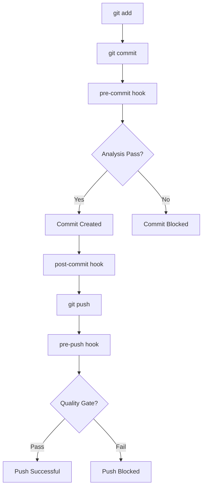

# Git 훅 기반 분석 기능 가이드

## 📖 개요

deps-cli는 Git 워크플로우에 완전히 통합되어 코드 변경사항에 대한 자동 의존성 분석을 제공합니다. Git 훅을 통해 커밋과 푸시 프로세스에서 자동으로 의존성을 검증하고 품질을 보장합니다.

## 🔗 Git 훅 구조

### 설치된 훅들

| 훅 이름 | 실행 시점 | 기능 |
|---------|-----------|------|
| **pre-commit** | 커밋 전 | 변경된 파일의 의존성 분석 및 검증 |
| **post-commit** | 커밋 후 | 의존성 변화 추적 및 메트릭 업데이트 |
| **pre-push** | 푸시 전 | 전체 프로젝트 품질 게이트 검증 |

### 워크플로우 다이어그램



## 🔍 Pre-Commit 훅

### 기능 설명

```bash
#!/bin/sh
# pre-commit: 커밋 전 의존성 검증
```

**주요 검증 항목:**
- 변경된 TypeScript/JavaScript 파일 식별
- 개별 파일의 의존성 분석
- 순환 의존성 탐지
- 위험 요소 식별
- 프로젝트 전체 의존성 상태 확인

### 실행 과정

```bash
🔍 deps-cli pre-commit analysis starting...
📁 Changed files:
  - src/config/ConfigManager.ts
  - test/config.test.ts

🔍 Analyzing dependencies for changed files...
  📄 Analyzing: src/config/ConfigManager.ts
  ⚠️ Risk factors detected in src/config/ConfigManager.ts:
    - high-complexity
  📄 Analyzing: test/config.test.ts

📊 Running project-wide dependency analysis...
✅ Project-wide analysis completed successfully

🔍 Checking for potential dependency issues...
✅ deps-cli pre-commit analysis completed successfully
🚀 Ready to commit!
```

### 검증 실패 시

```bash
❌ Circular dependencies detected in src/utils/helper.ts:
  - src/utils/helper.ts -> src/models/data.ts -> src/utils/helper.ts

❌ deps-cli analysis found critical issues
💡 Please fix circular dependencies before committing
```

**커밋이 차단되는 경우:**
- 순환 의존성 발견
- 치명적인 구문 오류
- 빌드 실패

## 📊 Post-Commit 훅

### 기능 설명

```bash
#!/bin/sh
# post-commit: 커밋 후 메트릭 추적
```

**주요 기능:**
- 의존성 스냅샷 생성
- 이전 커밋과의 변화 비교
- 메트릭 트렌드 기록
- 분석 히스토리 유지

### 실행 결과

```bash
📊 deps-cli post-commit analysis starting...
📋 Commit: a1b2c3d - Add new configuration system

🔍 Generating dependency snapshot...
✅ Dependency snapshot saved: .deps-cli-history/analysis_20250923_142030_a1b2c3d.json

📊 Current Metrics:
  📁 Total files: 45
  📄 Code files: 32
  🧪 Test files: 8
  🔗 Dependencies: 127

📈 Changes since last commit:
  📁 Files: +3
  🔗 Dependencies: +8
  🎯 Test coverage: 78%

✅ deps-cli post-commit analysis completed
```

### 생성되는 파일들

```
.deps-cli-history/
├── analysis_20250923_142030_a1b2c3d.json    # 의존성 스냅샷
├── analysis_20250923_135421_f4e5d6c.json    # 이전 스냅샷
├── dependency_trend.log                      # 트렌드 로그
└── ...
```

### 트렌드 로그 형식

```csv
timestamp,commit_hash,total_files,code_files,test_files,total_deps
20250923_142030,a1b2c3d,45,32,8,127
20250923_135421,f4e5d6c,42,29,8,119
20250923_131205,c7d8e9f,42,29,8,119
```

## 🚀 Pre-Push 훅

### 기능 설명

```bash
#!/bin/sh
# pre-push: 푸시 전 품질 게이트
```

**품질 검증 항목:**
- 전체 프로젝트 의존성 분석
- 순환 의존성 검사
- 테스트 커버리지 확인
- 코드 품질 메트릭 검증
- 고립된 파일 확인

### 품질 게이트 기준

| 메트릭 | 기준 | 조치 |
|--------|------|------|
| **순환 의존성** | 0개 | 🛑 푸시 차단 |
| **테스트 커버리지** | ≥30% | ⚠️ 경고 |
| **테스트/코드 비율** | ≥20% | ⚠️ 경고 |
| **고립된 파일** | ≤5개 | ⚠️ 경고 |

### 실행 결과

```bash
🚀 deps-cli pre-push analysis starting...
📡 Pushing to: origin (https://github.com/username/deps-cli.git)

🔍 Running comprehensive dependency analysis...
✅ Dependency analysis completed

📊 Project Health Summary:
  📁 Total files: 45
  📄 Code files: 32
  🧪 Test files: 8
  🔗 Dependencies: 127
  🎯 Test coverage: 78%

✅ Quality gate passed

📊 Cache performance:
  💾 Cache usage: 3/5 entries
  🎯 Cache hit rate: 85%

✅ deps-cli pre-push analysis completed
🚀 Ready to push!
```

### 품질 게이트 실패 시

```bash
❌ Circular dependencies detected: 2
⚠️ Low test coverage: 25%
⚠️ Low test to code ratio: 15%

❌ Quality gate failed: 1 critical issues
🛑 Push blocked due to quality issues
💡 Fix circular dependencies before pushing
```

## 📁 분석 히스토리 관리

### 자동 히스토리 유지

- **스냅샷 보관**: 최근 10개 분석 결과 유지
- **트렌드 로그**: 최근 100개 커밋 메트릭 추적
- **자동 정리**: 오래된 파일 자동 삭제

### 히스토리 조회

```bash
# 최근 분석 결과 확인
ls -lt .deps-cli-history/analysis_*.json | head -5

# 트렌드 데이터 확인
tail -10 .deps-cli-history/dependency_trend.log

# 특정 커밋의 분석 결과 확인
cat .deps-cli-history/analysis_*_a1b2c3d.json | jq '.report.summary'
```

## 🛠️ 설치 및 설정

### 자동 설치

```bash
# Git 훅 디렉토리로 복사
cp docs/hooks/* .git/hooks/
chmod +x .git/hooks/pre-commit .git/hooks/post-commit .git/hooks/pre-push
```

### 수동 설치

1. **pre-commit 훅 생성**
```bash
cat > .git/hooks/pre-commit << 'EOF'
#!/bin/sh
# deps-cli pre-commit hook
# [훅 내용...]
EOF
chmod +x .git/hooks/pre-commit
```

2. **post-commit 훅 생성**
```bash
cat > .git/hooks/post-commit << 'EOF'
#!/bin/sh
# deps-cli post-commit hook
# [훅 내용...]
EOF
chmod +x .git/hooks/post-commit
```

3. **pre-push 훅 생성**
```bash
cat > .git/hooks/pre-push << 'EOF'
#!/bin/sh
# deps-cli pre-push hook
# [훅 내용...]
EOF
chmod +x .git/hooks/pre-push
```

## ⚙️ 환경 변수 설정

### 훅 동작 제어

```bash
# 캐시 활성화 (성능 향상)
export DEPS_CLI_CACHE_ENABLED=true

# 디버그 모드 (상세 로그)
export DEPS_CLI_DEBUG=true

# 훅 비활성화 (긴급 상황)
export DEPS_CLI_SKIP_HOOKS=true
```

### 품질 게이트 조정

```bash
# 테스트 커버리지 최소 기준 (기본: 30%)
export DEPS_CLI_MIN_COVERAGE=50

# 순환 의존성 허용 (권장하지 않음)
export DEPS_CLI_ALLOW_CIRCULAR=true

# 고립 파일 경고 기준 (기본: 5개)
export DEPS_CLI_MAX_ISOLATED=10
```

## 🔧 커스터마이징

### 훅 수정

#### pre-commit 훅 커스터마이징

```bash
# 특정 파일 패턴 제외
CHANGED_FILES=$(git diff --cached --name-only --diff-filter=ACM | \
  grep -E '\.(ts|tsx|js|jsx)$' | \
  grep -v '\.d\.ts$' | \
  grep -v 'generated/' || true)

# 추가 검증 로직
check_import_style() {
  # import 스타일 검증 로직 추가
}
```

#### 품질 기준 조정

```bash
# pre-push 훅에서 기준 변경
MIN_COVERAGE=50  # 기본값 30에서 50으로 상향
MAX_ISOLATED=3   # 기본값 5에서 3으로 하향
```

### 알림 시스템 통합

```bash
# Slack 알림 추가 (post-commit)
send_slack_notification() {
  if [ "$TOTAL_DEPS" -gt 200 ]; then
    curl -X POST -H 'Content-type: application/json' \
      --data '{"text":"⚠️ Dependency count exceeded 200!"}' \
      $SLACK_WEBHOOK_URL
  fi
}
```

## 🚫 훅 비활성화

### 임시 비활성화

```bash
# 단일 커밋 시 훅 건너뛰기
git commit --no-verify -m "Emergency fix"

# 단일 푸시 시 훅 건너뛰기
git push --no-verify origin main
```

### 영구 비활성화

```bash
# 훅 파일 이름 변경
mv .git/hooks/pre-commit .git/hooks/pre-commit.disabled
mv .git/hooks/post-commit .git/hooks/post-commit.disabled
mv .git/hooks/pre-push .git/hooks/pre-push.disabled
```

## 📊 모니터링 및 분석

### 성능 메트릭

```bash
# 훅 실행 시간 측정
time git commit -m "Performance test"

# 캐시 히트율 확인
node -e "
const { globalConfig } = require('./dist/config/ConfigManager.js');
console.log(globalConfig.getCacheStats());
"
```

### 히스토리 분석

```bash
# 의존성 증가 추세 분석
awk -F, 'NR>1 {print $1, $6}' .deps-cli-history/dependency_trend.log | \
  tail -20

# 파일 증가 추세
awk -F, 'NR>1 {print $1, $3}' .deps-cli-history/dependency_trend.log | \
  tail -20
```

## 🎯 모범 사례

### 1. 점진적 도입

```bash
# 1단계: 경고만 표시 (차단하지 않음)
ENFORCE_QUALITY=false

# 2단계: 특정 기준만 적용
CHECK_CIRCULAR_DEPS=true
CHECK_COVERAGE=false

# 3단계: 전체 품질 게이트 활성화
ENFORCE_ALL=true
```

### 2. 팀 컨벤션

- **커밋 메시지**: 의존성 변경 시 명확한 설명 포함
- **PR 리뷰**: 의존성 스냅샷 리뷰 포함
- **릴리스**: 의존성 트렌드 보고서 첨부

### 3. CI/CD 통합

```yaml
# .github/workflows/deps-analysis.yml
name: Dependency Analysis
on: [push, pull_request]

jobs:
  deps-analysis:
    runs-on: ubuntu-latest
    steps:
      - uses: actions/checkout@v3
      - name: Setup Node.js
        uses: actions/setup-node@v3
        with:
          node-version: '18'
      - name: Install dependencies
        run: npm install
      - name: Build deps-cli
        run: npm run build
      - name: Run dependency analysis
        run: node dist/bin.js classify . --format json
      - name: Upload analysis results
        uses: actions/upload-artifact@v3
        with:
          name: dependency-analysis
          path: analysis-results.json
```

## 🔍 문제 해결

### 일반적인 문제들

#### 1. 훅이 실행되지 않음

```bash
# 실행 권한 확인
ls -la .git/hooks/

# 권한 부여
chmod +x .git/hooks/pre-commit .git/hooks/post-commit .git/hooks/pre-push
```

#### 2. deps-cli 빌드 실패

```bash
# 수동 빌드
npm run build

# 의존성 재설치
rm -rf node_modules package-lock.json
npm install
npm run build
```

#### 3. JSON 파싱 오류

```bash
# Node.js 버전 확인
node --version  # 18+ 권장

# jq 대신 Node.js 사용 (훅에서 자동 처리)
```

### 로그 확인

```bash
# Git 훅 로그 활성화
export GIT_TRACE=1

# deps-cli 디버그 로그
export DEPS_CLI_DEBUG=true

# 상세 실행 로그
git commit -v
```

이 가이드를 통해 deps-cli의 Git 훅 통합 기능을 완전히 활용하여 코드 품질과 의존성 관리를 자동화할 수 있습니다.