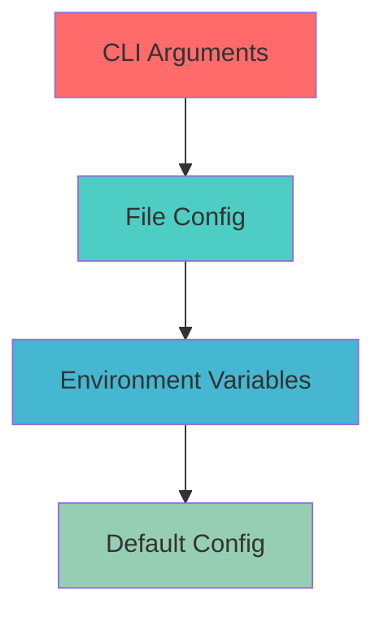

# 네임스페이스 기반 설정 관리 가이드

## 📋 목차

- [1. 개요](#1-개요)
- [2. 네임스페이스 기본 개념](#2-네임스페이스-기본-개념)
- [3. 설정 파일 구조](#3-설정-파일-구조)
- [4. CLI 사용법](#4-cli-사용법)
- [5. 환경별 설정 예시](#5-환경별-설정-예시)
- [6. 고급 사용법](#6-고급-사용법)
- [7. 마이그레이션 가이드](#7-마이그레이션-가이드)

## 1. 개요

deps-cli v2.0.0에서 도입된 **네임스페이스 기반 설정 시스템**은 환경별로 다른 분석 설정을 관리할 수 있게 해줍니다.

### 🎯 주요 이점

- **환경 분리**: development, production, staging 등 환경별 독립적 설정
- **설정 재사용**: 공통 설정 상속 및 환경별 오버라이드
- **팀 협업**: 표준화된 환경 설정으로 일관된 분석 결과
- **유연성**: 프로젝트 요구사항에 맞는 맞춤형 설정

## 2. 네임스페이스 기본 개념

### 2.1 네임스페이스란?

네임스페이스는 **특정 환경이나 컨텍스트에 대한 설정 그룹**입니다.

```typescript
interface Namespace {
  name: string                    // 네임스페이스 이름
  config: EnvironmentConfig      // 해당 환경의 설정
  description?: string           // 설명 (선택사항)
}

// 예시
const namespaces = {
  development: { /* 개발 환경 설정 */ },
  production: { /* 프로덕션 환경 설정 */ },
  staging: { /* 스테이징 환경 설정 */ },
  testing: { /* 테스트 환경 설정 */ }
}
```

### 2.2 설정 우선순위



1. **CLI Arguments** (최고 우선순위)
2. **File Config** (네임스페이스 설정)
3. **Environment Variables**
4. **Default Config** (최저 우선순위)

## 3. 설정 파일 구조

### 3.1 기본 파일 구조

```json
// deps-cli.config.json
{
  "default": "development",
  "namespaces": {
    "development": {
      "analysis": {
        "maxConcurrency": 4,
        "timeout": 30000
      },
      "logging": {
        "level": "debug",
        "verbose": true
      },
      "development": {
        "debugMode": true,
        "mockApiCalls": false
      }
    },
    "production": {
      "analysis": {
        "maxConcurrency": 8,
        "timeout": 60000
      },
      "logging": {
        "level": "info",
        "verbose": false
      },
      "development": {
        "debugMode": false,
        "mockApiCalls": false
      }
    },
    "staging": {
      "analysis": {
        "maxConcurrency": 6,
        "timeout": 45000
      },
      "logging": {
        "level": "warn",
        "verbose": true
      },
      "development": {
        "debugMode": true,
        "mockApiCalls": true
      }
    }
  },
  "_metadata": {
    "version": "2.0.0",
    "created": "2025-09-27T00:00:00.000Z"
  }
}
```

### 3.2 설정 스키마

```typescript
interface NamespacedConfig {
  default?: string                              // 기본 네임스페이스
  namespaces: Record<string, EnvironmentConfig> // 네임스페이스별 설정
  _metadata?: Record<string, ConfigMetadata>    // 메타데이터
}

interface EnvironmentConfig {
  analysis?: {
    maxConcurrency?: number     // 병렬 처리 수
    timeout?: number           // 타임아웃 (ms)
    excludePatterns?: string[] // 제외 패턴
  }

  logging?: {
    level?: 'debug' | 'info' | 'warn' | 'error'
    format?: 'text' | 'json'
    enabled?: boolean
    verbose?: boolean
  }

  output?: {
    defaultFormat?: 'summary' | 'json'
    compression?: boolean
    outputDir?: string
  }

  development?: {
    verbose?: boolean
    debugMode?: boolean
    mockApiCalls?: boolean
  }

  notion?: {
    apiKey?: string
    databaseId?: string
    pageId?: string
    apiVersion?: string
  }
}
```

## 4. CLI 사용법

### 4.1 네임스페이스 관리 명령어

#### 네임스페이스 목록 조회
```bash
# 사용 가능한 모든 네임스페이스 표시
deps-cli list-namespaces

# 출력 예시:
# Available namespaces:
# * development (default)
#   production
#   staging
#   testing
```

#### 새 네임스페이스 생성
```bash
# 빈 네임스페이스 생성
deps-cli create-namespace testing

# 기존 네임스페이스 복사하여 생성
deps-cli create-namespace production-v2 --copy-from production

# 생성 후 기본 네임스페이스로 설정
deps-cli create-namespace staging --set-default
```

#### 네임스페이스 삭제
```bash
# 네임스페이스 삭제 (확인 메시지 표시)
deps-cli delete-namespace testing

# 강제 삭제 (확인 없이)
deps-cli delete-namespace testing --force
```

### 4.2 네임스페이스로 분석 실행

#### 특정 네임스페이스 사용
```bash
# 프로덕션 환경 설정으로 분석
deps-cli --namespace production analyze-enhanced .

# 개발 환경 설정으로 미사용 파일 찾기
deps-cli --namespace development find-unused-files-enhanced

# 스테이징 환경 설정으로 메서드 사용처 찾기
deps-cli --namespace staging find-method-usages-enhanced UserService login
```

#### 기본 네임스페이스 사용
```bash
# 기본 네임스페이스 사용 (--namespace 생략)
deps-cli analyze-enhanced .

# 명시적으로 기본 네임스페이스 지정
deps-cli --namespace default analyze-enhanced .
```

### 4.3 설정 확인 및 디버깅

```bash
# 현재 로드된 설정 확인
deps-cli --namespace production analyze-enhanced . --dry-run

# 설정 파일 검증
deps-cli validate-config

# 네임스페이스별 설정 비교
deps-cli compare-namespaces development production
```

## 5. 환경별 설정 예시

### 5.1 Development 환경

```json
{
  "development": {
    "analysis": {
      "maxConcurrency": 4,        // 개발 머신 리소스 고려
      "timeout": 30000
    },
    "logging": {
      "level": "debug",           // 상세한 로그
      "verbose": true,
      "format": "text"
    },
    "output": {
      "defaultFormat": "summary", // 읽기 쉬운 형태
      "compression": false
    },
    "development": {
      "debugMode": true,          // 디버그 모드 활성화
      "verbose": true,
      "mockApiCalls": false
    }
  }
}
```

### 5.2 Production 환경

```json
{
  "production": {
    "analysis": {
      "maxConcurrency": 8,        // 서버 리소스 최대 활용
      "timeout": 60000,
      "excludePatterns": [
        "*.test.ts",
        "**/__tests__/**",
        "**/test/**"
      ]
    },
    "logging": {
      "level": "info",            // 필요한 정보만
      "verbose": false,
      "format": "json"            // 구조화된 로그
    },
    "output": {
      "defaultFormat": "json",    // 자동화 친화적
      "compression": true,        // 저장 공간 절약
      "outputDir": "./reports"
    },
    "development": {
      "debugMode": false,         // 프로덕션에서는 비활성화
      "verbose": false,
      "mockApiCalls": false
    }
  }
}
```

### 5.3 Staging 환경

```json
{
  "staging": {
    "analysis": {
      "maxConcurrency": 6,        // 중간 수준 리소스
      "timeout": 45000
    },
    "logging": {
      "level": "warn",
      "verbose": true,            // 문제 진단을 위해
      "format": "text"
    },
    "output": {
      "defaultFormat": "summary",
      "compression": false
    },
    "development": {
      "debugMode": true,          // 스테이징에서는 디버그 허용
      "verbose": true,
      "mockApiCalls": true        // 외부 API 호출 모킹
    },
    "notion": {
      "apiKey": "${STAGING_NOTION_API_KEY}",
      "databaseId": "${STAGING_NOTION_DB_ID}"
    }
  }
}
```

### 5.4 Testing 환경

```json
{
  "testing": {
    "analysis": {
      "maxConcurrency": 2,        // 테스트 환경에서는 리소스 절약
      "timeout": 20000
    },
    "logging": {
      "level": "error",           // 에러만 표시
      "verbose": false,
      "enabled": false            // 테스트 출력 방해 방지
    },
    "output": {
      "defaultFormat": "json",    // 테스트 검증을 위해
      "compression": false
    },
    "development": {
      "debugMode": false,
      "verbose": false,
      "mockApiCalls": true        // 모든 외부 호출 모킹
    }
  }
}
```

## 6. 고급 사용법

### 6.1 환경 변수와 연동

```json
{
  "production": {
    "analysis": {
      "maxConcurrency": "${DEPS_CLI_MAX_CONCURRENCY:8}",
      "timeout": "${DEPS_CLI_TIMEOUT:60000}"
    },
    "notion": {
      "apiKey": "${NOTION_API_KEY}",
      "databaseId": "${NOTION_DATABASE_ID}"
    }
  }
}
```

```bash
# 환경 변수 설정
export DEPS_CLI_MAX_CONCURRENCY=12
export NOTION_API_KEY=secret_xxx
export NOTION_DATABASE_ID=abc123

# 환경 변수가 설정에 자동 적용됨
deps-cli --namespace production analyze-enhanced .
```

### 6.2 설정 상속

```json
{
  "base": {
    "analysis": {
      "timeout": 30000,
      "excludePatterns": ["node_modules/**", ".git/**"]
    },
    "logging": {
      "format": "text",
      "enabled": true
    }
  },
  "development": {
    "extends": "base",
    "analysis": {
      "maxConcurrency": 4    // base 설정에 추가/오버라이드
    },
    "logging": {
      "level": "debug"       // base 설정에 추가
    }
  },
  "production": {
    "extends": "base",
    "analysis": {
      "maxConcurrency": 8,
      "timeout": 60000       // base 설정 오버라이드
    },
    "logging": {
      "level": "info"
    }
  }
}
```

### 6.3 동적 설정

```typescript
// 프로그래매틱 설정 업데이트
import { ConfigManager } from '@context-action/deps-cli'

const configManager = ConfigManager.getInstance()

// 런타임에 네임스페이스 설정 업데이트
await configManager.setNamespaceConfig('custom', {
  analysis: {
    maxConcurrency: detectSystemCores(),
    timeout: calculateOptimalTimeout()
  }
})

// 동적 네임스페이스로 분석 실행
const result = await configManager.loadWithNamespace({
  namespace: 'custom'
})
```

### 6.4 설정 검증

```typescript
// 설정 스키마 검증
interface ConfigValidator {
  validateNamespace(config: EnvironmentConfig): ValidationResult
  validateAllNamespaces(config: NamespacedConfig): ValidationResult[]
  suggestOptimizations(config: EnvironmentConfig): Suggestion[]
}

// 사용 예시
const validator = new ConfigValidator()
const result = validator.validateNamespace(config.namespaces.production)

if (!result.isValid) {
  console.error('Configuration errors:', result.errors)
  console.warn('Suggestions:', result.suggestions)
}
```

## 7. 마이그레이션 가이드

### 7.1 v1.x → v2.0.0 업그레이드

#### 기존 설정 파일 변환

**Before (v1.x):**
```json
{
  "maxConcurrency": 4,
  "timeout": 30000,
  "verbose": true,
  "outputFormat": "summary"
}
```

**After (v2.0.0):**
```json
{
  "default": "development",
  "namespaces": {
    "development": {
      "analysis": {
        "maxConcurrency": 4,
        "timeout": 30000
      },
      "logging": {
        "verbose": true
      },
      "output": {
        "defaultFormat": "summary"
      }
    }
  }
}
```

#### 자동 마이그레이션 도구

```bash
# 기존 설정 파일을 네임스페이스 형식으로 변환
deps-cli migrate-config deps-cli.config.json

# 변환 결과 미리보기
deps-cli migrate-config deps-cli.config.json --dry-run

# 백업 생성 후 변환
deps-cli migrate-config deps-cli.config.json --backup
```

### 7.2 팀 설정 표준화

#### 1. 기본 설정 템플릿 생성

```bash
# 프로젝트 초기 설정 생성
deps-cli init-config --template standard

# 생성되는 표준 템플릿:
# - development (개발용)
# - staging (스테이징용)
# - production (프로덕션용)
# - ci (CI/CD용)
```

#### 2. 설정 공유

```bash
# 현재 설정을 템플릿으로 내보내기
deps-cli export-config --template company-standard.json

# 팀원이 템플릿 가져오기
deps-cli import-config company-standard.json
```

#### 3. 설정 검증

```bash
# 팀 표준 설정과 비교
deps-cli validate-config --against standard

# CI/CD에서 설정 검증
deps-cli validate-config --strict --fail-on-warning
```

## 📚 관련 문서

- [데이터 플로우 아키텍처](./DATA_FLOW_ARCHITECTURE.md)
- [CLI 명령어 가이드](./DEPENDENCY_ANALYSIS_COMMANDS.md)
- [Enhanced 시스템](./ENHANCED_DEPENDENCY_ANALYSIS.md)
- [성능 분석](./ENHANCED_PERFORMANCE_COMPARISON.md)

---

**deps-cli v2.0.0** - 🚀 네임스페이스 기반 환경별 설정 관리

*마지막 업데이트: 2025-09-27*