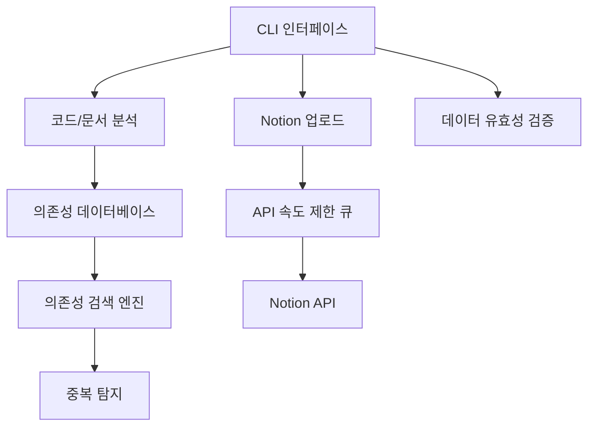

# deps-cli 개발 로드맵

## 🎯 프로젝트 비전

deps-cli를 코드 분석 및 문서 관리를 위한 통합 도구로 발전시켜, Notion과의 연동을 통한 완전한 프로젝트 관리 솔루션을 제공합니다.

## 🗺️ 전체 아키텍처 목표



## 📊 현재 구현 상태 (2025-09-27 - v2.0.0 출시)

### ✅ 완료된 기능

#### Phase 0: 핵심 분석 엔진 (100% 완료)
- [x] TypeScript/JavaScript 코드 분석
- [x] AST 기반 의존성 추출
- [x] 테스트 파일 분석

#### 🆕 v2.0.0 업데이트 (2025-09-27 완료)
- [x] **Biome 린팅 시스템 통합**: ESLint/Prettier 완전 교체
- [x] **네임스페이스 설정 관리**: 환경별 설정 시스템
- [x] **테스트 안정성 대폭 향상**: 144개 테스트 100% 통과
- [x] **CLI 사용성 개선**: 이모지와 향상된 도움말
- [x] **타입 안전성 강화**: 엄격한 TypeScript 설정
- [x] 문서 파일 분석
- [x] 병렬 처리 지원
- [x] 메타데이터 생성
- [x] CLI 옵션 정리 및 간소화
- [x] CLI 기능 테스트 (18개 테스트 통과)
- [x] 빌드 및 린트 검증

**CLI 명령어:**
```bash
deps-cli analyze <path>                    # 코드 의존성 분석
deps-cli analyze <path> --format json      # JSON 형식 출력
deps-cli classify <path>                   # 파일 분류 및 저장
deps-cli classify <path> --output-dir dir  # 결과 디렉토리 지정
```

### 🚧 진행 중인 작업

현재는 핵심 분석 기능이 안정화되었으며, 다음 단계를 위한 준비가 완료된 상태입니다.

## 🛣️ 향후 개발 계획

### Phase 1: 설정 관리 시스템 (✅ 완료 - v2.0.0)

**목표**: 사용자 설정 및 프로젝트 설정 관리

**기능:**
- [x] 기본 CLI 구조 (완료)
- [x] **네임스페이스 설정 파일 관리** (`deps-cli.config.json`)
- [x] **환경별 설정 지원** (development, production, staging)
- [x] **CLI 명령어로 설정 관리** (create/delete/list namespaces)
- [ ] Notion API 토큰 관리 (다음 단계로 연기)
- [ ] ignore 패턴 설정 (다음 단계로 연기)

**구현된 CLI 명령어:**
```bash
deps-cli list-namespaces                   # 네임스페이스 목록 조회
deps-cli create-namespace <name>           # 새 네임스페이스 생성
deps-cli delete-namespace <name>           # 네임스페이스 삭제
deps-cli --namespace <name> <command>      # 특정 네임스페이스로 실행
```

### Phase 2: 고급 설정 및 확장 기능 (예상: 2025-11-15)

**목표**: Notion API 통합 및 ignore 패턴 지원

**기능:**
- [ ] Notion API 토큰 관리 시스템
- [ ] ignore 패턴 설정 (`.gitignore` 스타일)
- [ ] 프로젝트별 설정 템플릿
- [ ] 설정 검증 및 자동 복구
- [ ] 성능 최적화 설정

**새로운 CLI 명령어:**
```bash
deps-cli config init                       # 설정 초기화
deps-cli config set notion-token <token>   # Notion 토큰 설정
deps-cli config set ignore "node_modules/**" # ignore 패턴 설정
deps-cli config validate                   # 설정 검증
```

### Phase 2.5: 구조적 마크다운 매핑 시스템 (예상: 2025-12-01)

**목표**: 의존성 분석 결과를 Notion 연동을 위한 구조적 마크다운으로 매핑

**🎯 핵심 개념:**
- **다층 ID 시스템**: 파일 ID와 메서드 ID를 독립적으로 부여하여 코드 이동에도 매핑 유지
- **역할 기반 분류**: 테스트 코드, 서비스 코드, 유틸리티 코드 등 역할별 자동 분류
- **영구 참조**: 파일명이나 위치 변경과 무관하게 ID 기반으로 관계 추적
- **계층적 매핑**: 파일 → 클래스 → 메서드 등 다층 구조의 독립적 문서화

**🔬 연구 및 고도화 필요 영역:**

**1. ID 시스템 설계**
- 파일 ID vs 메서드 ID 생성 알고리즘 (해시 기반, UUID, 의미적 ID)
- 코드 리팩토링 시 ID 추적 및 매핑 유지 전략
- 파일 이동, 메서드 이동, 이름 변경 등에 대한 ID 안정성 보장
- 버전별 ID 히스토리 관리 방안

**2. 역할 기반 분류 시스템**
- 테스트 코드, 서비스 코드, 유틸리티 코드, 설정 파일 등 자동 분류
- 디렉토리 구조, 파일명 패턴, import 관계 기반 역할 판정
- 프로젝트별 커스텀 분류 규칙 정의
- 다중 역할을 가진 파일/메서드 처리 방법

**3. 계층적 매핑 전략**
- 파일 → 클래스 → 메서드 등 다층 구조의 독립 문서 생성
- 각 계층별 적절한 정보 분배 (상세도 조절)
- 계층 간 참조 링크 자동 생성
- 복잡한 상속, 인터페이스 관계의 계층 표현

**4. 영구 참조 시스템**
- ID 기반 링크로 파일 이동에도 견고한 참조 유지
- 끊어진 링크 감지 및 자동 복구 메커니즘
- 리팩토링 도구와의 연동을 통한 ID 업데이트
- 레거시 ID와 새 ID 간의 매핑 테이블 관리

**🛠️ 초기 프로토타입 기능:**
- [ ] **파일 ID 생성기**: 컨텐츠 해시 기반 안정적 ID 부여
- [ ] **메서드 ID 생성기**: 시그니처 기반 독립적 ID 부여
- [ ] **역할 분류기**: 파일 경로, 패턴, import 분석으로 자동 분류
- [ ] **계층적 문서 생성**: 파일/클래스/메서드별 독립 마크다운 생성
- [ ] **ID 기반 링크**: 물리적 경로 대신 ID로 문서 간 참조
- [ ] **매핑 테이블**: ID-경로-역할 매핑 정보 저장 및 관리

**새로운 CLI 명령어 (실험적):**
```bash
deps-cli id generate                       # 전체 프로젝트 ID 생성
deps-cli id mapping show                   # 현재 ID 매핑 테이블 조회
deps-cli classify roles                    # 파일/메서드 역할 분류 결과
deps-cli markdown generate --by-id         # ID 기반 마크다운 생성
deps-cli mapping verify                    # 매핑 무결성 검증
```

### Phase 3: 데이터 저장소 (예상: 2025-12-15)

**목표**: 분석 결과의 지속적 저장 및 검색

**기능:**
- [ ] SQLite 기반 로컬 데이터베이스
- [ ] 의존성 관계 저장
- [ ] 파일 변경 히스토리 추적
- [ ] 의존성 검색 API
- [ ] 데이터 마이그레이션 지원

**새로운 CLI 명령어:**
```bash
deps-cli store init                        # 데이터베이스 초기화
deps-cli store query <pattern>             # 의존성 검색
deps-cli store history <file>              # 파일 변경 히스토리
deps-cli store migrate                     # 데이터 마이그레이션
```

### Phase 3: Notion 연동 (예상: 4-5주)

**목표**: Notion과의 완전한 연동

**기능:**
- [ ] Notion API 클라이언트
- [ ] 마크다운 → Notion 페이지 변환
- [ ] 코드 분석 결과 → Notion 데이터베이스
- [ ] 속도 제한 처리 큐
- [ ] 증분 업데이트 지원
- [ ] 양방향 동기화

**새로운 CLI 명령어:**
```bash
deps-cli upload notion                     # 전체 업로드
deps-cli upload docs                       # 문서만 업로드
deps-cli upload code                       # 코드 분석 결과만 업로드
deps-cli sync                             # 양방향 동기화
deps-cli upload status                     # 업로드 상태 확인
```

### Phase 4: 린트 및 검증 시스템 (예상: 2-3주)

**목표**: 데이터 품질 관리 및 검증

**기능:**
- [ ] 중복 의존성 탐지
- [ ] 순환 의존성 검사
- [ ] 미사용 의존성 탐지
- [ ] 코드 품질 메트릭
- [ ] 문서 일관성 검증

**새로운 CLI 명령어:**
```bash
deps-cli lint duplicates                   # 중복 탐지
deps-cli lint circular                     # 순환 의존성 검사
deps-cli lint unused                       # 미사용 의존성 탐지
deps-cli lint validate                     # 전체 검증
deps-cli lint fix                         # 자동 수정
```

### Phase 5: 고급 분석 (예상: 3-4주)

**목표**: 더 정교한 분석 및 인사이트 제공

**기능:**
- [ ] 마크다운 링크 의존성 분석
- [ ] 프로젝트 아키텍처 시각화
- [ ] 의존성 영향도 분석
- [ ] 코드 복잡도 분석
- [ ] 리팩토링 제안

**새로운 CLI 명령어:**
```bash
deps-cli analyze links                     # 마크다운 링크 분석
deps-cli analyze architecture              # 아키텍처 분석
deps-cli analyze impact <file>             # 영향도 분석
deps-cli analyze complexity                # 복잡도 분석
deps-cli suggest refactor                  # 리팩토링 제안
```

### Phase 6: 웹 인터페이스 (예상: 4-6주)

**목표**: 시각적 인터페이스 제공

**기능:**
- [ ] 웹 기반 대시보드
- [ ] 인터랙티브 의존성 그래프
- [ ] 실시간 분석 결과 표시
- [ ] 프로젝트 메트릭 시각화
- [ ] 팀 협업 기능

**새로운 CLI 명령어:**
```bash
deps-cli serve                            # 웹 서버 시작
deps-cli dashboard                        # 대시보드 열기
deps-cli export html                      # HTML 리포트 생성
```

## 📈 마일스톤

### v1.0.0 - 핵심 분석 엔진 ✅
- **완료일**: 2025-09-23
- **기능**: 코드 분석, 의존성 추출, 기본 CLI

### v2.0.0 - Biome 통합 및 네임스페이스 설정 ✅
- **완료일**: 2025-09-27
- **기능**: Biome 린팅, 네임스페이스 설정 관리, 144개 테스트 안정화, 타입 안전성 강화

### v2.1.0 - 고급 설정 시스템 (Target: 2025-11-15)
- **기능**: Notion API 통합, ignore 패턴, 설정 검증

### v1.2.0 - 데이터 저장소 (Target: 2025-11-15)
- **기능**: SQLite DB, 검색, 히스토리 추적

### v2.0.0 - Notion 연동 (Target: 2025-12-20)
- **기능**: Notion API, 문서 동기화, 업로드 큐

### v2.1.0 - 린트 시스템 (Target: 2026-01-15)
- **기능**: 중복 탐지, 검증, 자동 수정

### v3.0.0 - 고급 분석 (Target: 2026-02-15)
- **기능**: 링크 분석, 아키텍처 분석, 리팩토링 제안

### v4.0.0 - 웹 인터페이스 (Target: 2026-04-01)
- **기능**: 웹 대시보드, 시각화, 팀 협업

## 🔧 기술 스택 계획

### 현재 기술 스택
- **런타임**: Node.js 20+
- **언어**: TypeScript 5.0+
- **CLI**: Commander.js 14.0
- **의존성 분석**: @context-action/dependency-linker
- **파일 매칭**: glob
- **빌드**: tsup
- **테스트**: Vitest
- **린팅**: ESLint + Prettier

### 계획된 기술 스택 추가
- **데이터베이스**: SQLite3 (better-sqlite3)
- **API 클라이언트**: @notionhq/client
- **큐 시스템**: bull-queue
- **웹 프레임워크**: Fastify (Phase 6)
- **프론트엔드**: React + D3.js (Phase 6)

## 🤝 기여 가이드

### 현재 기여 우선순위
1. **Phase 1**: 설정 관리 시스템 구현
2. **테스트 커버리지** 확대
3. **문서화** 개선
4. **성능 최적화**

### 기여 방법
1. Issue 생성 또는 기존 Issue 선택
2. Feature branch 생성 (`feature/phase1-config-system`)
3. 구현 및 테스트 작성
4. Pull Request 생성
5. 코드 리뷰 및 병합

## 📚 관련 문서

- [아키텍처 문서](./ARCHITECTURE.md) - 전체 시스템 아키텍처
- [API 문서](./API.md) - 내부 API 레퍼런스
- [기여 가이드](../CONTRIBUTING.md) - 개발 참여 방법
- [변경 로그](../CHANGELOG.md) - 버전별 변경 사항

## 📞 문의 및 피드백

- **GitHub Issues**: 버그 리포트 및 기능 요청
- **GitHub Discussions**: 일반적인 질문 및 아이디어 논의
- **Email**: [maintainer@deps-cli.dev](mailto:maintainer@deps-cli.dev)

---

**마지막 업데이트**: 2025-09-23
**문서 버전**: 1.0.0
**작성자**: deps-cli 개발팀