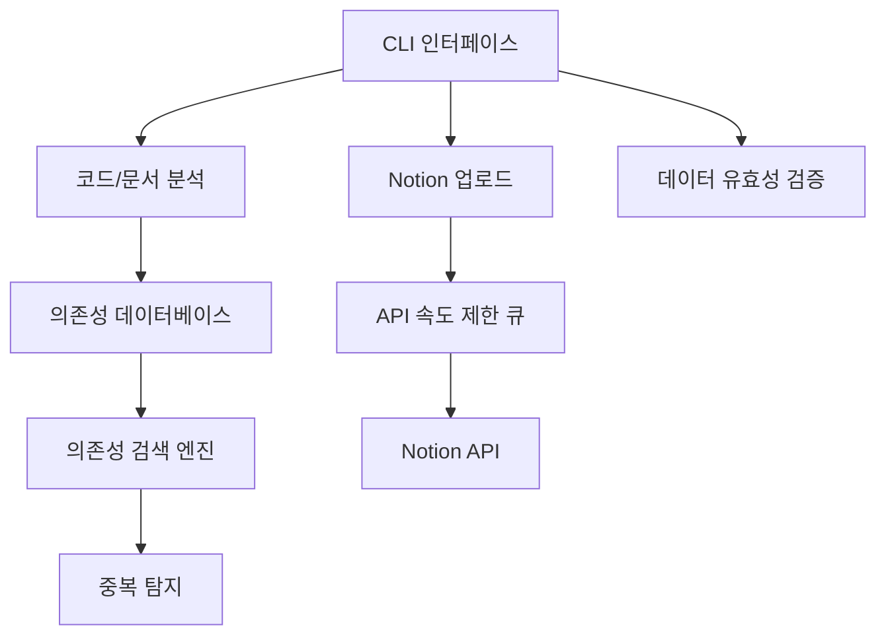

# deps-cli 개발 로드맵

## 🎯 프로젝트 비전

deps-cli를 코드 분석 및 문서 관리를 위한 통합 도구로 발전시켜, Notion과의 연동을 통한 완전한 프로젝트 관리 솔루션을 제공합니다.

## 🗺️ 전체 아키텍처 목표



## 📊 현재 구현 상태 (2025-09-24)

### ✅ 완료된 기능

#### Phase 0: 핵심 분석 엔진 (100% 완료)
- [x] TypeScript/JavaScript 코드 분석
- [x] AST 기반 의존성 추출
- [x] 테스트 파일 분석
- [x] 문서 파일 분석
- [x] 병렬 처리 지원
- [x] 메타데이터 생성
- [x] CLI 옵션 정리 및 간소화
- [x] CLI 기능 테스트 (18개 테스트 통과)
- [x] 빌드 및 린트 검증

**CLI 명령어:**
```bash
deps-cli analyze <path>                    # 코드 의존성 분석
deps-cli analyze <path> --format json      # JSON 형식 출력
deps-cli classify <path>                   # 파일 분류 및 저장
deps-cli classify <path> --output-dir dir  # 결과 디렉토리 지정
```

### 🚧 진행 중인 작업

현재는 핵심 분석 기능이 안정화되었으며, 다음 단계를 위한 준비가 완료된 상태입니다.

## 🛣️ 향후 개발 계획

### Phase 1: 설정 관리 시스템 (예상: 2-3주)

**목표**: 사용자 설정 및 프로젝트 설정 관리

**기능:**
- [x] 기본 CLI 구조 (완료)
- [ ] 설정 파일 관리 (`deps-cli.config.json`)
- [ ] Notion API 토큰 관리
- [ ] 프로젝트별 설정 지원
- [ ] ignore 패턴 설정

**새로운 CLI 명령어:**
```bash
deps-cli config init                       # 설정 초기화
deps-cli config set notion-token <token>   # Notion 토큰 설정
deps-cli config set ignore "node_modules/**" # ignore 패턴 설정
deps-cli config list                       # 현재 설정 조회
```

### Phase 2: 데이터 저장소 (예상: 3-4주)

**목표**: 분석 결과의 지속적 저장 및 검색

**기능:**
- [ ] SQLite 기반 로컬 데이터베이스
- [ ] 의존성 관계 저장
- [ ] 파일 변경 히스토리 추적
- [ ] 의존성 검색 API
- [ ] 데이터 마이그레이션 지원

**새로운 CLI 명령어:**
```bash
deps-cli store init                        # 데이터베이스 초기화
deps-cli store query <pattern>             # 의존성 검색
deps-cli store history <file>              # 파일 변경 히스토리
deps-cli store migrate                     # 데이터 마이그레이션
```

### Phase 3: Notion 연동 (예상: 4-5주)

**목표**: Notion과의 완전한 연동

**기능:**
- [ ] Notion API 클라이언트
- [ ] 마크다운 → Notion 페이지 변환
- [ ] 코드 분석 결과 → Notion 데이터베이스
- [ ] 속도 제한 처리 큐
- [ ] 증분 업데이트 지원
- [ ] 양방향 동기화

**새로운 CLI 명령어:**
```bash
deps-cli upload notion                     # 전체 업로드
deps-cli upload docs                       # 문서만 업로드
deps-cli upload code                       # 코드 분석 결과만 업로드
deps-cli sync                             # 양방향 동기화
deps-cli upload status                     # 업로드 상태 확인
```

### Phase 4: 린트 및 검증 시스템 (예상: 2-3주)

**목표**: 데이터 품질 관리 및 검증

**기능:**
- [ ] 중복 의존성 탐지
- [ ] 순환 의존성 검사
- [ ] 미사용 의존성 탐지
- [ ] 코드 품질 메트릭
- [ ] 문서 일관성 검증

**새로운 CLI 명령어:**
```bash
deps-cli lint duplicates                   # 중복 탐지
deps-cli lint circular                     # 순환 의존성 검사
deps-cli lint unused                       # 미사용 의존성 탐지
deps-cli lint validate                     # 전체 검증
deps-cli lint fix                         # 자동 수정
```

### Phase 5: 고급 분석 (예상: 3-4주)

**목표**: 더 정교한 분석 및 인사이트 제공

**기능:**
- [ ] 마크다운 링크 의존성 분석
- [ ] 프로젝트 아키텍처 시각화
- [ ] 의존성 영향도 분석
- [ ] 코드 복잡도 분석
- [ ] 리팩토링 제안

**새로운 CLI 명령어:**
```bash
deps-cli analyze links                     # 마크다운 링크 분석
deps-cli analyze architecture              # 아키텍처 분석
deps-cli analyze impact <file>             # 영향도 분석
deps-cli analyze complexity                # 복잡도 분석
deps-cli suggest refactor                  # 리팩토링 제안
```

### Phase 6: 웹 인터페이스 (예상: 4-6주)

**목표**: 시각적 인터페이스 제공

**기능:**
- [ ] 웹 기반 대시보드
- [ ] 인터랙티브 의존성 그래프
- [ ] 실시간 분석 결과 표시
- [ ] 프로젝트 메트릭 시각화
- [ ] 팀 협업 기능

**새로운 CLI 명령어:**
```bash
deps-cli serve                            # 웹 서버 시작
deps-cli dashboard                        # 대시보드 열기
deps-cli export html                      # HTML 리포트 생성
```

## 📈 마일스톤

### v1.0.0 - 핵심 분석 엔진 ✅
- **완료일**: 2025-09-23
- **기능**: 코드 분석, 의존성 추출, 기본 CLI

### v1.1.0 - 설정 관리 (Target: 2025-10-15)
- **기능**: 설정 시스템, ignore 패턴, 프로젝트 설정

### v1.2.0 - 데이터 저장소 (Target: 2025-11-15)
- **기능**: SQLite DB, 검색, 히스토리 추적

### v2.0.0 - Notion 연동 (Target: 2025-12-20)
- **기능**: Notion API, 문서 동기화, 업로드 큐

### v2.1.0 - 린트 시스템 (Target: 2026-01-15)
- **기능**: 중복 탐지, 검증, 자동 수정

### v3.0.0 - 고급 분석 (Target: 2026-02-15)
- **기능**: 링크 분석, 아키텍처 분석, 리팩토링 제안

### v4.0.0 - 웹 인터페이스 (Target: 2026-04-01)
- **기능**: 웹 대시보드, 시각화, 팀 협업

## 🔧 기술 스택 계획

### 현재 기술 스택
- **런타임**: Node.js 20+
- **언어**: TypeScript 5.0+
- **CLI**: Commander.js 14.0
- **의존성 분석**: @context-action/dependency-linker
- **파일 매칭**: glob
- **빌드**: tsup
- **테스트**: Vitest
- **린팅**: ESLint + Prettier

### 계획된 기술 스택 추가
- **데이터베이스**: SQLite3 (better-sqlite3)
- **API 클라이언트**: @notionhq/client
- **큐 시스템**: bull-queue
- **웹 프레임워크**: Fastify (Phase 6)
- **프론트엔드**: React + D3.js (Phase 6)

## 🤝 기여 가이드

### 현재 기여 우선순위
1. **Phase 1**: 설정 관리 시스템 구현
2. **테스트 커버리지** 확대
3. **문서화** 개선
4. **성능 최적화**

### 기여 방법
1. Issue 생성 또는 기존 Issue 선택
2. Feature branch 생성 (`feature/phase1-config-system`)
3. 구현 및 테스트 작성
4. Pull Request 생성
5. 코드 리뷰 및 병합

## 📚 관련 문서

- [아키텍처 문서](./ARCHITECTURE.md) - 전체 시스템 아키텍처
- [API 문서](./API.md) - 내부 API 레퍼런스
- [기여 가이드](../CONTRIBUTING.md) - 개발 참여 방법
- [변경 로그](../CHANGELOG.md) - 버전별 변경 사항

## 📞 문의 및 피드백

- **GitHub Issues**: 버그 리포트 및 기능 요청
- **GitHub Discussions**: 일반적인 질문 및 아이디어 논의
- **Email**: [maintainer@deps-cli.dev](mailto:maintainer@deps-cli.dev)

---

**마지막 업데이트**: 2025-09-23
**문서 버전**: 1.0.0
**작성자**: deps-cli 개발팀